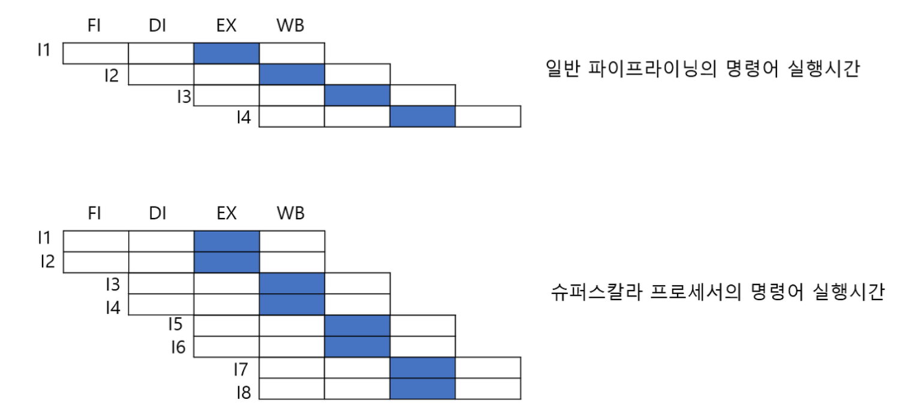
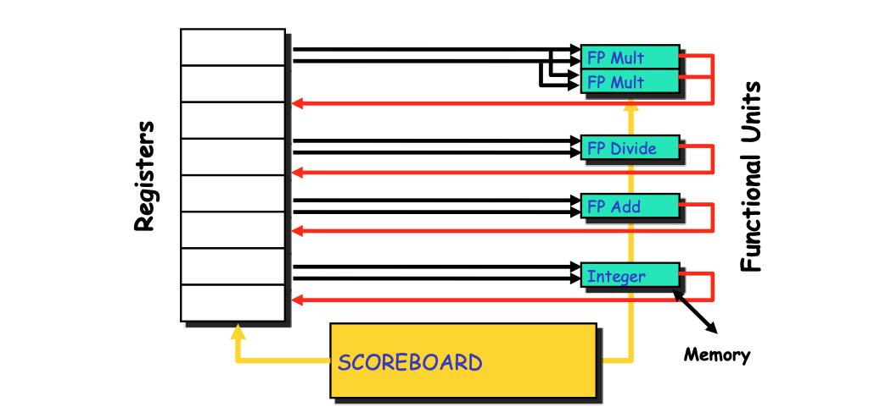
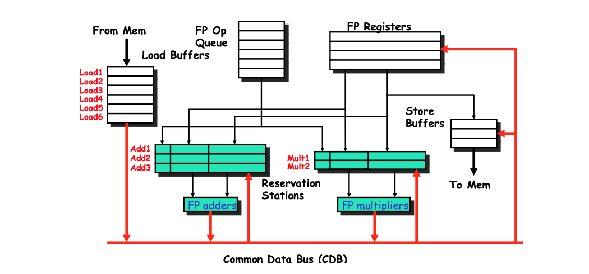

Parallelism은 크게 3가지로 구분됩니다.
1. Instruction
2. Data
3. Thread

# Instruction Level Parallelism

## 1. ILP에서의 Dependence

### ILP 란?
- 하나의 `superscalar 프로세서`에서 동시에 실행될 수 있는 `instruction 평균 갯수`
- 이는 inst 간의 dependence에 영향을 받는다
- Application 자체의 특성으로 응용프로그램에 든 ILP는 한정되어있음 (ILP Wall)

#### 슈퍼스칼라 프로세서란?
: 일반적 파이프라인 기법의 확장을 통해 CPU의 속도를 향상시키기 위한 컴퓨터 구조 설계 방식



### ILP에서의 제약사항
1. Resource Conflicts
2. Dependence

Dependence도 크게 3가지로 나누는데,  
그 중 Data dependence가 찐 디펜던스고 (그래서 true dependence)  
Name dependence(Anti/output)는 사실상 resource conflicts에 의해 발생

### Dependence

1. True dependence: `RAW hazard`
  - Read After Write
  - 이 depnedence에서는 반드시 선행 inst가 먼저 실행되어야 함
  - Cannot be executed simultaneously

2. Anti dependence: `WAR hazard`
  - Write After Read
  - 이 경우에도 inst의 실행순서가 지켜져야 함
  - 하지만 2번째 inst의 r1을 r6로 바꾼다면? 병렬로 실행이 가능!

3. Output dependence: `WAW hazard`
  - Write After Write
  - 이 경우에도 inst의 실행순서가 지켜져야 함 (이후에 r3를 참조할 때 마지막 inst의 결과가 참조되어야 하니까)
  - 하지만 이 또한 2번째 inst를 r3가 아닌 다른 레지스터를 사용한다면? 병렬로 실행이 가능!

Name Dependence의 솔루션:
더 많은 register를 사용한다 --> **Renaming resource**

> Renaming에 implicit/explicit 방법이 있는데, explicit한 renaming은 하드웨어 레벨의 테크닉이기 때문에 우리는 implicit에 집중할 것

## 2. Dynamic Scheduling

### Dynamic Scheduling이란?

Dynamic Scheduling이란? Rearrange order of Instruction

실행 중인 명령어들 사이에서 의존성을 파악하여 실행 순서를 재조정

- **why?** 실행시간(stall 즉, idle cycle)을 줄이기 위해!
- **how?** instruction들의 data flow를 유지하면서!

> 컴파일러는 ISA에 대한 abstraction을 보고 있고 CPU에서 insturction을 re-ordering 하는 것

> 즉, 컴파일러에서 다이나믹 스케줄링을 고려할 필요는 없다!
> 그러나 CPU에서 control overhead가 발생하는 것은 단점이긴 함

#### Static vs. Dynamic

학부 컴퓨터구조에서 배웠던 MIPS 파이프라인 구조에서는 dynamic scheduling 기법이 적용되어있지 않음

Static Scheduilng: MIPS에서는 명령어가 순차적으로 실행됨.

> 물론 MIPS에서도 dependence 이슈를 해결하기 위해 fowarding과 같은 기법을 사용하지만, 이러한 기법들은 dynamic scheduling과 함께 사용될 때 더욱 효과적으로 성능을 개선할 수 있음

Dynamic scheduling 방식을 사용하면 static 대비 명령어의 수행 순서를 최적화하고, 파이프라인 실행률을 향상시킬 수 있다

#### Dynamic Scheduling의 대표적인 방법

1. Scoreboard
2. Tomasulo Algorithm

### Scoreboard

다이나믹 스케줄링의 가장 기초적인 CPU 구조

`Register + Functional Unit + Scoreboard`



- Functional Unit
  - mutiplier
  - divider
  - adder
  - integer unit (for memory access)
- Scoreboard
  - <u>manage status of functional unit and availability of registers</u>

#### 4-stages pipeline

예시에서는 4-stage pipeline을 볼 것

**1. Issue**
  - `Structure hazard` 확인
  - 이는 곧 availability of functional unit (e.g. 하드웨어 구조적으로 지금 multiplier가 available한 지?)
  - 또한 `WAW hazard`도 확인
  - Structure, WAW hazard가 생길 가능성이 있다면 issue를 하지 않는다 (stall)

**2. Read operand**
  - `Data(RAW) hazard`가 없는 지 확인하고 수행된다 (RAW hazard는 이 단계에서 resolved)
  - We read operands only when they are ready
  - 참고로 Scoreboard에서는 pipeline fowarding이 적용되지 않음

**3. Execution**

**4. Write result**
  - `WAR hazard`를 확인
  - WAR hazard가 생길 가능성이 있다면 write하지 않는다 (stall)

#### Scoreboard component

**Notation**
- Fi:	Dest register
- Fj,Fk: Source-register numbers
- Rj,Rk: status of register (Yes means ready)
- Qj,Qk: Which FU waiting for it

**FU latency**
- Add: 2 clock
- Mul: 10 clock
- Div: 40 clock

#### Scoreboard example

```
PPT 15p~41p 예제 반드시 따라가기
```

#### Out-of-order execute

In-order issue; Out-of-order execute

이슈는 program 순서대로 되었지만 실제 실행은 순서대로 진행되지 않음

**By doing out-of-order execute and commit, we can reduce the total cycle of this program**

#### Limitation in Scoreboard

Better solution: Tomasulo

1. 포워딩을 하지 않았음 --> Common Data Bus를 통해 해결!
2. Wait for WAR hazard in write --> additional register를 통해 해결!
3. Prevent WAW hazard in issue --> additional register를 통해 해결!
4. Prevent structual hazard in issue --> 얘는 토마슐로도 똑같음

### Tomasulo

다이나믹 스케줄링에서 엄청 유명한 알고리즘

특히 WAR, WAW hazard와 같은 resource conflict를 해결하기 위해 Register Renaming한 부분을 집중해서 볼 것

`6 Load unit + Reservation station(3 Add + 2 Mult) + Common Data Bus`



#### Reservation station

Reservation station은 토마슐로에서 사용되는 Additional register를 의미함 (`renaming`)

Reservation station에서 제공하는 additional register를 사용하므로써 WAR/WAW hazard를 resolve 시킬 수 있음  
--> 이제 RAW hazard만 남게 됨

**Reservation Station Components**
- Op: operation type
- Vj,Vk: operand들의 "값" --> content copy 개념!
- Qj,Qk: Which RS waiting for it
- Busy: RS 또는 FU가 busy한 지 여부

#### Common Data Bus

Common Data Bus는 Reservation Station과 연결됨  
Mem에 있는 데이터를 "directly" adder와 multiplier에 보낸다

즉, CDB `foward` the result of FU directly to waiting FU

#### 3-stages pipeline

토마슐로에서는 3-stage pipeline로 simplified

**1. Issue**
  - Reservation Station이 free한지 확인
  - 이는 곧 `Structure hazard`를 방지

**2. Execution**
  - 모든 operand가 ready가 될 때 까지 Common Data Bus를 watch

**3. Write result**
  - Common Data Bus에 write하고
  - reservation station이 available하다고 마킹

#### Tomasulo example 1

```
PPT 51p~72p
```

> additional register에 content가 바로 저장되는 것과 operator 결과가 broadcasting 되는 것에 주목!

> Assume: Load 실행에 2 cycle 소요

#### Tomasulo vs. Scoreboard

Key difference:
1. Reservation station의 additional register를 통해 `Renaming`을 했다는 것
2. Common Data Bus의 브로드캐스트를 통해 `Fowarding`을 구현한 것

물론 다른 아키텍처적인 차이도 있음 (e.g. 슬롯 갯수의 차이)  
그런데 가장 key diff는 저 2개라는 것

#### Tomasulo example 2

```
PPT 74p~96p
```
