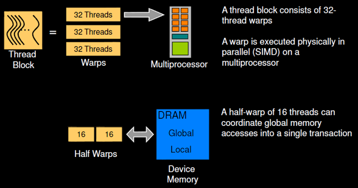

ILP의 한계: There can be much higher natural parallelism in some applications

- Thread Level Parallelism: instruction stream with own PC and data
같은 코드를 돌리지만 각각이 각자의 data와 PC를 가지고 있다

- Data Level Parallelism: Perform identical operations on data, and lots of data
Data level parallelism은 결국 SIMD를 얘기하는 것

Thread level 과 data level의 가장 큰 차이점은 Program Counter를 갖느냐 아니냐의 차이가 가장 큽니다

# Data Level Parallelism

- Vector Architecture
- SIMD Extensions

## Vector Processing <!-- TODO -->

Vector processing

Operation type은 동일하고 input data가 다른 경우를 처리할 수 있는 구조  
--> SIMD (single instruction, multiple data)

Matmul의 dot product과 같이 Same sequence of operation for the multiple data 구조에서 유용함

# Thread Level Parallelism

## GPUs

### SM (Stream Multiprocessor)

- 같은 코드를 16개 프로세서에서 돌리고 각 프로세서는 다른 input data를 받는 상황을 가정해보자
- 같은 프로그램 코드를 쓰기 때문에 16개의 프로세서가 거의 동일한 일을 수행
- 즉, 각 프로세서의 fetch/decode가 거의 동일할 것


- fetch decode는 cpu가 한번씩만 하고 execute만 parallel하게 가정해보자
- fetch/decode에 드는 로드를 ALU들이 공유하는 구조 (large register file이 필요)
- 각 레인은 register file의 subset을 사용 --> 각 thread 별로 자신만의 register file을 갖는 것 처럼!
- 각 레인의 thread는 shared memory를 통해 서로 통신한다 (뒤에 메모리 hierarchy에서 다룰 것)

### Thread Hierarchy


- Thread: 연산을 수행하는 최소단위 --> 하나의 scalar processor에 맵핑
- Warp: 하드웨어상 연산을 스케줄링하는 최소 단위 (32 thread)
- Thread Block: thread의 집합 (Warp들로 구성) --> multiprocessor(SM)에 맵핑
- Grid: GPU chip에 맵핑 (GPU는 여러 개의 SM으로 구성)



multiprocessor의 compute unit이 보통 32개! 근데 돌릴 thread가 1024개라면?

Warp는 32개 thread로 묶여있는 그룹이며, 1 cycle에는 하나의 warp만 동시에 돌아간다! (하드웨어 스펙에 의함)

SM에서 1 cycle에 돌릴 수 있는 thread는 32개

### Branch Handling


Warp 안의 여러 thread의 실행 경로가 다른 경우 --> Conditional Execution  
하드웨어가 자동으로 divergence를 처리

> 한계점: warp 중 일부는 true고 일부는 false라면 idel cycle이 생김

### Hardware Context Switch

**How to handle stalls?**

warp 실행 중 cache miss가 발생한다면? --> Memory access latency (over 100 cycle)  
다음 instruction을 실행할 수 없으니 stall이 발생한다.


하나의 SM에서 context switching을 통해 하나 이상의 warp를 번갈아 가면서 실행한다면?!


하나의 warp에서 memory access하는 동안 다른 wrap를 돌릴 수 있다.  
그래서 GPU 아키텍처에서 context switching을 지원한다!

### GPU Memory Hierarchy

#### Register 및 Local Memory

- 각 thread에는 reigster와 local memory가 할당
- Per-thread private memory (다른 thread의 private memory에 접근 못함)
- local memory는 하드웨어적으로 디바이스 메모리에 위치해서 접근이 느림

#### Shared Memory

- Per-block shared memory
- 각 thread block 내 thread들이 데이터를 공유하기 위해 사용 (다른 thread block에는 접근 못함)

> 사용자가 명시적으로 프로그래밍하는 캐시

#### Global Memory

- 계층 최하단 메모리로 대부분의 데이터가 저장되는 메모리
- 호스트 메모리와 DMA 통신 가능

#### Constant Memory

- 글로벌 메모리와 같은 층위
- 변하지 않는 상수 데이터만 저장

#### 메모리 아키텍처

| 메모리 모델 | 실제 데이터가 저장되는 메모리 아키텍처 |
| :------------- | :------------- |
| Register | Register File |
| Local Memory | GPU Memory |
| Shared Memory | Shared Memory |
| Global Memory | GPU Memory |
| Constant Memory | GPU Memory |

- Register File
  - thread context 저장
  - 가장 빠른 메모리
- Shared Memory
  - SM 별로 할당되어있음
  - 두번째로 빠른 메모리로 L1 데이터 캐시로도 사용함
- GPU Memory
  - 셋 중 가장 느린 DRAM
  - 모든 SM에서 접근이 가능

## CUDA Example

```c
__global__
void vecAddKernel(float* A_d, float* B_d, float* C_d, int n)
{
    int i = threadIdx.x + blockDim.x * blockIdx.x;
    if(i<n) C_d[i] = A_d[i] + B_d[i];
}
```
```c
vecAddKernel<<<블락갯수, 블락크기>>>(A_d, B_d, C_d, n);
```

thread idx를 기준으로 동일한 코드를 돌리면서 다른 데이터를 주입


### Memcpy Primitive

```c
cudaMalloc(&deviceA, sizeof(int) * 1024);
cudaMemcpy(deviceA, A, sizeof(int) * 1024, cudaMemcpyHostToDevice);
cudaMemcpy(A, deviceA, sizeof(int) * 1024, cudaMemcpyDeviceToHost);
cudaFree(deviceA);
```

호스트와 디바이스는 각자 자신의 메모리 공간을 가짐  
--> CPU-GPU communication을 위해서는 `cudaMemcpy()`를 수행해야 함

하지만 굉장히 typical한 방법이 아래 방법을 사용할 수 있다:
1. Stream: data copy와 cpu computation을 오버랩핑 하는 방법
2. Mapped memory: 동일한 physical address를 공유하고 다른 virtual address를 사용한다 (cudaMemcpy를 안함)

위 두 방법을 더한 게 **Shared virtual address space**

<!-- TODO: 이거 내용 강의영상 다시 듣거나 검색할 것 -->

### MatMul 예제

for loop로 돌리는 dot production을 thread parallel하게 돌릴 수 있다

```c
// 2차원으로 할당
dim3 dimGrid(1, 1);
dim3 dimBlock(N, N);

matMul<<<dimGrid, dimBlock>>>(dev_a, dev_b, dev_c);
```

### Convolution 예제

```c
output[i] = (intput[i] + intput[i+1] + intput[i+2]) / 3.f;
```
하나의 thread는 gpu 메인 메모리의 3개 data를 읽고, 1개 data를 써야 해 (3 read/1 write)

```c
__global__ void convolve(int N, float* input, float* output) {
  // shared memory를 활용하겠다!
  __shared__ float support[THREADS_PER_BLK+2];
  int index = blockIdx.x * blockDim.x + threadIdx.x;

  // 기존 THREADS_PER_BLK*3 load inst를 THREADS_PER_BLK+2로 줄임
  support[threadIdx.x] = intput[index];
  if(threadIdx.x < 2) {
    support[THREADS_PER_BLK + threadIdx.x] = input[index + THREADS_PER_BLK]
  }

  // 모든 thread가 위의 명령까지 동작하도록 sync 맞추기 위함
  __syncthreads();

  // 각 thread는 하나의 element에 대한 연산을 수행
  float result = 0.0f;
  for (int i=0; i<3; i++)
    result += support[threadIdx.x + i];
  output[index] = result / 3.f;
}
```

## Thread block scheduler

Special HW in GPU. Thread block을 어느 SM에 맵핑할거냐!

CPU가 thread block scheduler에 아래 정보들을 보낸다
1. Block에서 요구하는 리소스 정보
2. 각 SM의 available resource 정보

(리소스를 많이 필요로하는 thread는 리소스가 많이 남은 SM으로 보내야지)

> thread block의 실행은 블럭 간 디펜던스 없이 어느 순서로도 실행할 수 있기에 가능

#### CUDA 컴파일
컴파일을 할 때 `# register/thread`를 지정하므로써 최적화를 할 수 있다.

- 작으면: 캐시사이즈가 줄어드니 memory access time이 늘어날 것
- 크면: 모든 로컬변수를 register에 저장할 수 있지만 지정할 수 있는 thread의 수가 줄어들 것

#### V100 GPU


- V100 SM 하나는 4개의 sub-cores를 가짐
- Warp 하나에 32 thread
- sub-core 마다 warp 할당 --> 총 128 thread
- 각 sub-core는 64kb 레지스터 --> 총 256kb 레지스터
- 각 thread는 최대 64kb 레지스터를 가질 수 있음 (warp가 64kb니까)

Thread block scheduler는 이 register와 shared memory 리소스가 얼마나 남았는 지 확인하고 thread를 SM에 할당한다.

### Running the CUDA kernel

<!-- TODO: PPT 65p~78p 확인 -->
```
PPT 65p~78p 확인
```

## GPU 최적화

<!-- TODO: 여기 다 다시 정리할 것!!!! 81p부터!! -->

GPU의 제한된 on-chip 메모리 이슈를 해결하기 위한 3가지 대표적인 방법

1. **Memory latency hiding** by multi-threading
2. **Blocking** to exploit small on-chip memory
3. **Data layout & memory request coalescing** to reduce bank conflict and # memory requests

### 1. Memory latency hiding

thread를 최대한 많이 써라.
thread block size는 프로그래머가 정할 수 있지만 쿠다 버전에 따라 최대로 정할 수 있는 쓰레드 수가 정해져있다.

### 2. Blocking

GPU는 캐시를 thread들이 나눠서 사용하기 때문에 thread 당 할당되는 cache capacity가 매우 낮다.

캐시로서 충분한가? 충분하다! 왜?
cache에서 data reuse를 하는 게 목적이 아니라 data buffering을 하는게 목적이기 때문에!

타일링 설명...

### 3. Data layout & memory request coalescing
