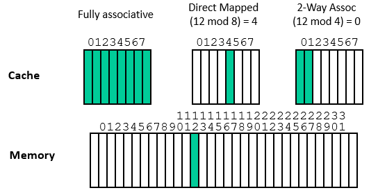
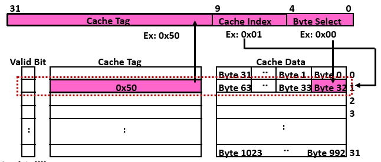
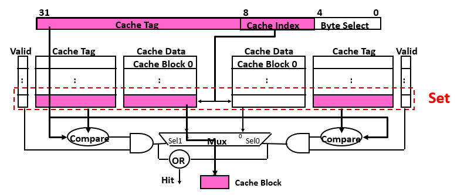
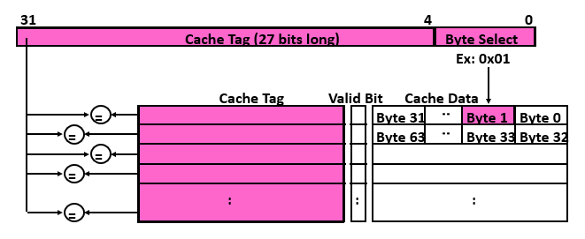

# Cache and Optimizations

- Memory Hierarchy: Exploiting Principle of Locality
- Processor Cache Basics: Four Design Questions
- Six Basic Cache Optimizations
- Ten Advanced Cache Optimizations
- Cache compression
- Cache coherency

## Cache Basics

### 1. Block Placement

N번 블락을 Cache 어디에 놔야하는가?
1. Direct Mapped Cache
2. N-way associative Cache
3. Fully associative Cache

| | 각 Set의 way 수 | Set 개수 | Block Placement |
| --- | --- | --- | --- |
| **Fully Associative** | 8 (entire cache) | 1 | 어디든 가져다둘 수 있다 |
| **Directed Mapped** | 1 | 8 | 오직 딱 정해진 곳에만 둘 수 있다 |
| **2-way Associative** | 2 | 4 | 2개 way 중 선택할 수 있다 |

**Sources of cache misses**
- Compulsory miss (Cold miss)
- Capacity miss
- Conflict miss
- Coherence miss

### 2. Finding Block

- 프로세스에서 메모리 공간에 접근할 때 virtual memory를 사용
- Pagination에서 virtual --> physical로 변환한 후에 접근함

#### 1KB Directed Mapped Cache with 32B Blocks

- **Block offset**: cache block size가 32B라면 5bit
- **Set index**: cache 1KB라면 1KB/32B = 32개 set --> 5bit
- **Tag**: 나머지 22bit를 tag로 사용

#### 2-way Set Associative Cache

- **Block offset**: cache block size가 32B라면 5bit
- **Set index**: cache 1KB라면 (1KB/32B)/2way = 16개 set --> 4bit
- **Tag**: 나머지 23bit를 tag로 사용

#### Fully Associative Cache

- **Block offset**: cache block size가 32B라면 5bit
- **Set index**: X
- **Tag**: 나머지 27bit를 tag로 사용

### 3. Replacement Policy
- Random: often used for fully associative
- LRU: 2way에서나 실제로 사용함 (나머지는 cost)
- Pseudo LRU: binary tree often used for 4-8 way
- RRIP: New data의 prioiry position을 low position에 둔다

### 4. Write Policy

Cache hit?
- Write through
- Wrtie back

Cache miss?
- No write allocate
- Write allocate

**Write buffer**
- Write-through에서 문제: write할 때, cache도 업데이트하고 memory도 업데이트 해야해 --> 오래걸린다

write buffer를 사용!
cache에도 쓰고 memory에도 쓰고가 아니라
cache에도 쓰고 memory에 쓸 write buffer에 집어넣고 cpu는 다음동작으로 넘어가

Write-back operation에서 발생하는 blocking을 방지

## Basic Cache Optimizations

1. Larger block size
2. Larger total cache capacity
3. Higher associativity
4. Higher number of cache levels
5. Giving priority to read misses over writes
6. Avoiding address translation in cache indexing

## Advanced Cache Optimizations
앞의 내용과 duplicated 있음 참고

1. Small and simple L1 caches
2. Way prediction
3. Pipelining cache access
4. Nonblocking caches to reduce miss penalty **중요**
5. Multi-banked Caches
6. Critical word first, early restart
7. Write merging (or coalescing) in the write buffer
8. Compiler Optimizations
9. Hardware prefetching
10. Compiler-controlled prefetching

## Cache compression
