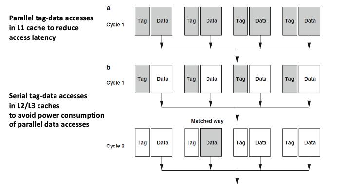

# Cache and Optimizations

- Memory Hierarchy: Exploiting Principle of Locality
- Processor Cache Basics: Four Design Questions
- Six Basic Cache Optimizations
- Ten Advanced Cache Optimizations
- Cache compression
- Cache coherency

## Cache Basics

### 1. Block Placement

N번 블락을 Cache 어디에 놔야하는가?
1. Direct Mapped Cache
2. N-way associative Cache
3. Fully associative Cache


| | 각 Set의 way 수 | Set 개수 | Block Placement |
| --- | --- | --- | --- |
| **Fully Associative** | 8 (entire cache) | 1 | 어디든 가져다둘 수 있다 |
| **Directed Mapped** | 1 | 8 | 오직 딱 정해진 곳에만 둘 수 있다 |
| **2-way Associative** | 2 | 4 | 2개 way 중 선택할 수 있다 |

**Sources of cache misses**
- Compulsory miss (Cold miss)
- Capacity miss
- Conflict miss
- Coherence miss

### 2. Finding Block

- 프로세스에서 메모리 공간에 접근할 때 virtual memory를 사용
- Pagination에서 virtual --> physical로 변환한 후에 접근함

#### 1KB Directed Mapped Cache with 32B Blocks


- **Block offset**: cache block size가 32B라면 5bit
- **Set index**: cache 1KB라면 1KB/32B = 32개 set --> 5bit
- **Tag**: 나머지 22bit를 tag로 사용

#### 2-way Set Associative Cache


- **Block offset**: cache block size가 32B라면 5bit
- **Set index**: cache 1KB라면 (1KB/32B)/2way = 16개 set --> 4bit
- **Tag**: 나머지 23bit를 tag로 사용

#### Fully Associative Cache


- **Block offset**: cache block size가 32B라면 5bit
- **Set index**: X
- **Tag**: 나머지 27bit를 tag로 사용

### 3. Replacement Policy
- Random: often used for fully associative
- LRU: 2way에서나 실제로 사용함 (나머지는 cost)
- Pseudo LRU: binary tree often used for 4-8 way
- RRIP: New data의 prioiry position을 low position에 둔다

### 4. Write Policy

Cache hit?
- Write through
- Wrtie back

Cache miss?
- No write allocate
- Write allocate

**Write buffer**
- Write-through에서 문제: write할 때, cache도 업데이트하고 memory도 업데이트 해야해 --> 오래걸린다

write buffer를 사용!
cache에도 쓰고 memory에도 쓰고가 아니라
cache에도 쓰고 memory에 쓸 write buffer에 집어넣고 cpu는 다음동작으로 넘어가

Write-back operation에서 발생하는 blocking을 방지

## Basic Cache Optimizations

1. Larger block size
2. Larger total cache capacity
3. Higher associativity
4. Higher number of cache levels
5. Giving priority to read misses over writes
6. Avoiding address translation in cache indexing

## Advanced Cache Optimizations
앞의 내용과 duplicated 있음 참고

1. Small and simple L1 caches
2. Way prediction
3. Pipelining cache access
4. Nonblocking caches to reduce miss penalty **중요**
5. Multi-banked Caches
6. Critical word first, early restart
7. Write merging (or coalescing) in the write buffer
8. Compiler Optimizations
9. Hardware prefetching
10. Compiler-controlled prefetching

### 2. Way Prediction

#### Parallel tag-data access

L1 캐시에서는 latency가 정말 중요한 metric이다!

To minimize latency, L1 캐시에서는 tag와 data를 동시에 parallel하게 엑세스하자

But high energy consumption: hit 되지 않을 데이터에도 접근하는 것이기 때문

To reduce power consumption --> Way Prediction

#### Way Prediction

일반적으로 프로그램에서 instruction이 sequential 하게 실행될 때, 같은 instruction cache block을 consecutive하게 접근하게 될 것

이를 통해 어느 way로 access 할 지 prediction할 수 있다

- 원래대로라면 2 clock이 걸렸을 cache hit time
- Way prediction을 하면 1 clock으로 줄일 수 있음
- 하지만 prediction을 실패해도, 원래의 hit time 정도만큼 걸린다는 것

#### Line Fill Buffer

Cache Miss가 발생했을 때, 메모리로부터 cache line을 가져오는 과정에서 임시로 저장해두는 버퍼

Cache Miss가 발생할 때 Line fill buffer를 이용하면 데이터를 가져오는 데 필요한 시간을 절약할 수 있다

캐시 미스가 발생하면 해당 데이터를 포함하는 캐시 라인을 메모리로부터 가져와야 함
그러나 이 작업은 상대적으로 오랜 시간이 걸리기 때문에, CPU는 먼저 해당 데이터를 요청하고 LFB에 저장

#### Serial tag-data access



L1 캐시는 latency가 중요해서 parallel tag-data access를 수행

하지만 L2 캐시는 high associativity를 사용하기 때문에 parallel을 사용하면 energy consumption이 너무 커서 serial access를 수행

#### Counting bloom filter

Minimize unnecessary tag accesses


- 카운터가 각 cache way 앞에 놓여져있다 (특히 tag 직전에)
- 특정 way에 대한 non-existence에 대해 early respons를 받을 수 있다!

즉, 이 way에 cache가 없다고 response 를 받으면 tag comparision 을 할 필요가 없다는 것!

How it works?
- data에 엑세스하면 entry의 count를 늘린다
- 이 주소는 cache되어 있을 수도 있고 아닐수도 있다
- 0x200은 확실하게 이 캐시에 없음을 알 수 있다 --> cache miss를 바로 반납!! (true negative)
- 0x300은 1이라고 뜬다? --> hit인지 아닌지 한번 더 확인 필요 (false positive)

### 4. Non-blocking Caches

Cache miss가 발생하면 miss penalty(memory access time)이 발생한다.

Non-blocking cache는 MSHR(Miss State Holding Register)를 이용해서 miss penalty 동안 cache request를 계속 처리한다.

#### MSHR

Cache miss가 발생하였을 때, miss request 정보를 저장하는 register
- enables the cache to serve cache hits during cache misses
- avoid duplicate cache miss requests (to the memory) on the same cache block.

#### miss under miss (hit under multiple miss)

- cache request에서 miss가 발생했을 때, memory에 miss request를 보내고 그 동안 cache request를 계속 처리
- 또 다시 cache miss가 발생한 경우에도, memory에 새로운 miss request를 보내고 cache request를 계속 처리
- multiple miss penalty가 overlapping된다.

**Average miss penalty를 줄인다!**


왜 cache에서 memory에 parallel하게 접근이 가능한가?
- memory를 bank로 나누어서 memory-level parallelism이 가능하기 때문

### 9. Hardware Prefetching

Prefetch = 미리 캐시에 가져온다

- Instruction prefetch
- Data prefetch


- Software-controlled prefetching
  - 프로그래머가 직접 prefetch 코드를 짜거나 compiler를 사용하거나
  - 하지만 컴파일러 구현이 쉽지 않음
- Hardware-controlled prefetching
  - 업데이트가 쉽지 않음

#### 9.1 Prefetch 할 때 고려사항
1. What to prefetch --> **prefetch accuracy**
  - 데이터 액세스 패턴을 잘 봐서 뭘 prefetch 해올 지 잘 결정해야 함
2. When to prefetch --> **prefetch latency**
  - 프리패치를 실제 접근하는 시간보다 너무 빨리하면 낭비다
3. Where to store prefetch data --> **cache pollution**
  - prefetch data 때문에 실제 엑세스할 data를 evict 시킨 경우 낭비다

#### 9.2 Instruction Prefetch

Instruction을 prefetch 할 때 그 다음 instruction도 같이 prefetch 해오자!

근데 where to store prefetch data?
- L1 instruction cache 앞에 stream buffer를 두자
- cache pollution을 피할 수 있도록!


나중에 CPU가 prefetch instruction에 접근할 때 stream buffer에서 L1 instruction cache로 가져온다!

#### 9.3 Data Prefetch

Data prefetch는 instruction 보다는 access pattern이 복잡하다ㅠ
- instruction prefetch 처럼 `continuous prefetch`도 고려하지만,
- `stride prefetch`도 같이 고려해야 함

Stride란? Address difference

```c
float a[100][100], b[100][100], c[100][100];
for (i = 0; i < 100; i++)
  for (j = 0; j < 100; j++)
    for (k = 0; k < 100; k++)
      a[i][j] += b[i][k] * c[k][j];
```


1. 1st iteration = inital state / inital state / inital state
2. 2nd iteration = trans state / trans state / steady state
3. 3rd iteratoin = steady state / steady state / steady state

- steady state에서 prefetch 해온다 / trans state에서 prefetch 해온다

**Prefetch Aggressiveness**

- prefetch degree = prefetch할 캐시 블럭의 수
- prefetch distance = prefetch할 데이터의 stride

Prefecth degree도 높고 distance도 높으면 aggressive 한 것!

하지만 aggressive하다고 항상 퍼포먼스가 높은 것이 아니다

--> 프리패쳐가 runtime 중에 동적으로 aggresivness를 결정한다.

**Prefetch Accuracy**

우리는 런타임 중에 prefetch accuracy를 적은 오버헤드로도 계산할 수 있다!

- prefetch accuracy = # of useful prefetch / total prefetch
- 여기서 useful prefetch는 prefetch를 한 이후에 실제 접근까지 한 prefetch 데이터를 의미한다.
- 이를 측정하기 위해 prefetch flag, access flag를 사용하며, cache evict 시점에 두 flag가 모두 1일 때 useful임을 확정한다

**Adaptive prefetch**

프리패쳐가 1) prefetch accracy 2) prefetch lateness 3) cache pollution 을 다이나믹하게 계산하고 aggressiveness를 결정

- accuracy가 낮으면 aggressiveness(distance, degree)를 낮춘다
- accuracy가 높으면 aggressiveness(distance, degree)를 높인다


## Cache Compression


Base + Delta encoding
- 하나의 데이터를 base로 잡고 distance를 계산해서 distance만 저장한다
