# Main Memory

- DRAM
- Memory access scheduling, address mapping, QoS
- Refresh, row hammering, error correction code
- Virtual to physical address translation
- Processing-in-memory

## 1. DRAM

### Background

목표: Memory latency를 줄이자!

- Main memory can dominate total power consumption in server
- As DRAM capacity increases, refresh power will get more significant

### DRAM Architecture

아래 그림과 같이 2D array의 bit로 구성되어있음
- row(word line)에 먼저 접근하고
- column(bit line)을 선택

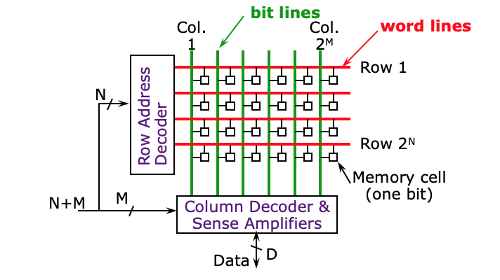

DRAM은 large memory
- wire가 길수록 access time이 줄어들기 때문에
- 한 memory를 8 banks로 쪼갠다
- Bank는 사실상 independent memory
- 1개의 뱅크는 memory array로 구성되어있다 (1000x1000 1MB 저장)

### Accessing DRAM Cells

DRAM은 Capacitor로 작동하는 방식
- Fully charged cCELL
- Half charged cBL

2. Activate row
3. Read the voltage of bit-line
5. Precharging: cut off the connection

#### DRAM Command

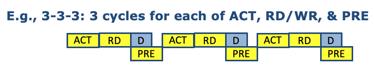

- ACT: row activation
- RD: selecting column (to read data)
- D: Data
- PRE: precharge while data read

> PRE와 D가 parallel하게 동작

#### DRAM Timing Parameter

- tRC: minimum time from ACT to ACT (tRAS + tRP)
- tRCD: minimum time from ACT to CAS
- CL: minimum time from CAS to RD (CAS latency)
- tRP: minimum time from PRE to ACT (Precharge latency)

> E.g., CL, tRP, tRCD 각각 5 cycle씩 소요

## 2. Memory Access Scheduling

CPU와 Memory 사이에는 memory controller가 존재하고,
memory controller는 request buffer를 가지고 있다.

--> CPU는 multiple memory access를 요청할 수 있음

### Problem in FCFS
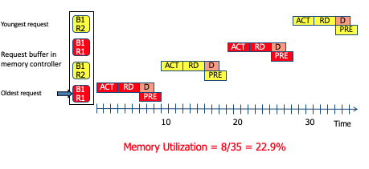

> R1, R2는 row를 의미 / B1, B2는 bank를 의미

- Memory controller deals with the requests first-in, first-out
- 1번 request를 처리하기 위해 R1을 먼저 ACT 시킴
- 2번 request의 R2을 동시에 ACT 시킬 수 없어서 대기가 발생
- B1 R1이 PRE한 이후에 B1 R2를 오픈
- 3번 request가 들어오면 다시 B1 R1을 오픈
- 4번 request가 들어오면 다시 B1 R2를 오픈

Memory controller have to use more ACT and PRE command than the optimal case.

### Open row access

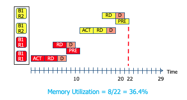

Activate 된 row에 있는 애를 먼저 할당하자!

- Request buffer의 순서를 바꿔준다! (2번 <--> 3번)
- ACT 시켜준 row와 같은 곳에 있는 데이터를 읽는다
- Row buffer hit --> ACT, PRE를 아낌
- total cycle이 35에서 22로 줄면서 메모리 유틸이 올라갔다!

--> First Ready Scheduling

### Memory Access Scheduling Policy

1. FCFS
  - In-order, i.e., first-come-first-serve

2. FR (First ready)
  - Open(Activated) row에 있는 애를 먼저 할당하자
  - idle bank에 있는 애를 먼저 할당하자 (비어있으니까 먼저 보내)

3. Read over write
  - read request가 write 보다 우선시 됨

4. Consecutive read or write
  - DRAM I/O는 바이디렉셔널
  - write operation 하는 중에 read를 한다면 direction을 바꿔야 해
  - 디렉션을 바꾸는 건 오버헤드 (1~2 사이클)
  - 즉, read를 실행했다면 계속 read를 하는게 좋다는겨

## 3. Address Mapping

Question --> data를 어느 주소공간에 둘 것인가?

### Bank Interleaving

**아까 Bank1에만 있던 memory request가 Bank2로 분산된다면?**

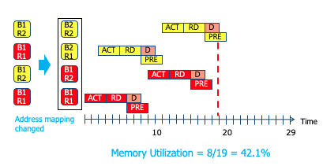

- 1번 request를 처리하는데, B2가 idle하다 --> 3번 request를 먼저 보낼 수 있다!
- 이 그림은 각 bank에서 open row를 사용하지 않는 상황인데도 memory utilization이 늘었다!

> note)
- Bank는 independent memory이기 때문에 B1, B2에 패러렐하게 접근할 수 있다
- 하지만 multiple bank들이 하나의 data IO pin을 공유하고 있음
- we can transfer one data at a time (data transfer까지 parallel하게 할 수 없음)

**4개 request를 4개 bank로 분산시킨다면?**

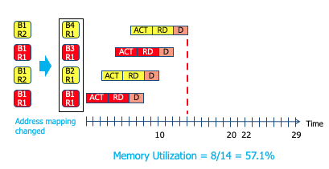

**--> Memory level parallelism (best for latency!)**

#### How can we distribute our data?

**We need to serialize accesses to different banks**

이미지 데이터를 핸들링하는 상황을 가정해보자

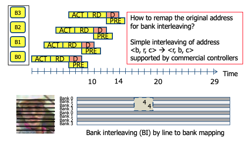

아래와 같이 physical address에서 각 portion들이 bank(2bit), row, column(10bit)을 가리키고 있음

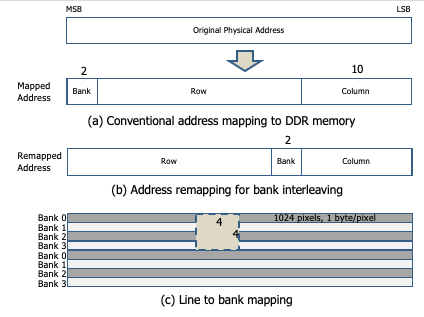

- (a) `<b,r,c>`를 사용하면 이미지에서 다음 line이 같은 bank에 저장되어있을 것
- (b) `<r,b,c>`를 사용하면 다음 line이 각각 다른 bank에 저장되어있을 것

위 그림에서 이미지에 4x4로 접근할 때 4개 라인이 4개의 bank로 분산된다

#### Bank Interleaving의 단점

Bank Interleaving은 power consumption에 있어서는 좋은 방법은 아님
- 왜? ACT는 DRAM에서 가장 power consumption이 큰 command라서!
- 4개 request에 대해서 bank interleaving 할 때보다 open row를 쓸 때가 energy consumption이 2배 낮음!

**결론**: address mapping과 memory access scheduling을 함께 고려하면 latency를 많이 낮출 수 있다!

#### Open row access + Bank interleaving

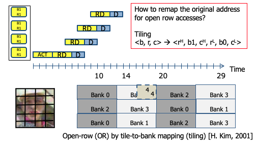

- `<b,r,c> --> <r, b, c>`를 한번 더 쪼개서
- `<b,r,c> --> <r,b,c,r,b,c>`로 쪼개자

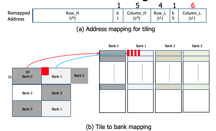

그럼 위와 같이 4x4로 접근할 때 모든 data들이 같은 bank의 같은 row에 존재할 수 있게 됨!

#### XOR interleaving

같은 memory address로 캐시와 메인 메모리에 둘다 접근함

- cache에서의 set index와 bank index가 겹침
- 즉, 같은 set에 할당될 cache block이 같은 block에 있다

**문제**
- cache miss가 발생할 때 같은 bank에서 읽어와 --> bank conflict --> miss penalty가 증가

**솔루션**
- `Original bank index`와 `cache tag의 일부 비트`에 대해 XOR를 시켜서 새로운 bank index를 적용하자

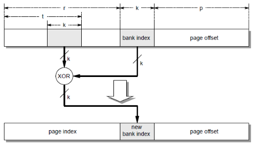
