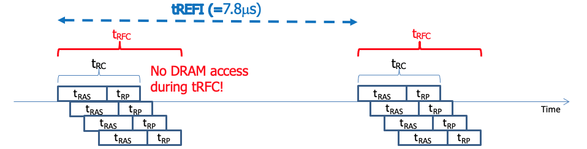

# Main Memory Issues

- **Refresh**
- Row hammering
- Error correction code

## 1. Refresh

Refresh = Activation + Precharge

- 이 사이클을 다 갖는 것은 결국 1번 상태로 돌아오기 위해 refresh 했다는 것
- 즉, activation부터 precharge까지 하면 refresh를 했다는 것

### 1.1 Auto refresh command

Memory Controller는 auto refresh 커멘드를 주기적으로 디램에 보낸다.

DRAM은 auto refresh 요청을 받으면 1~8 row를 refresh 시킴 (ACT부터 PRE까지 돌려준다)

- 이 주기가 `tREFI` (REFresh Interval)
- 리프레시하는 시간은 `tRFC` (ReFreshCycle time)

tRFC 동안 DRAM에 read/write를 못해 --> 오버헤드

### 1.2 Refresh Overhead

1. Performance 이슈 (tRFC 동안 DRAM에 read/write를 못해)
2. Worst case memory access latency

**How to resolve it?**
1. Postponing or pulling auto-refresh commands
2. Fine-grained auto-refresh (e.g., 16k auto-refresh commands per 64ms)

### 1.3 Performance 이슈

- refresh command를 수행하는 동안 data transfer를 못한다
- 이는 메모리 사이즈가 커질 수록 overhead가 커진다

#### Memory capacity vs. Refresh overhead

8192 refresh commands / 64 ms 라고 가정!

DRAM capacity가 증가할 수록 tRFC가 커짐

| capacity | rows / each refresh command | tRFC |
| :--- | :--- | :--- |
| 2GB | 32k / 8k = 4 rows | 197.5ns |
| 4GB | 64k / 8k = 8 rows | 327.5ns |

- DRAM 사이즈 별로 refresh overhead를 계산해보자

| capacity | refresh overhead | utilization |
| :------------- | :------------- | :--- |
| 2GB | 8192 * 197.5ns / 64ms = 2.5% | 97.5% |
| 4GB | 8192 * 327.5ns / 64ms = 4.2% | 95.8% |

**메모리 사이즈가 커질수록 refresh overhead가 커진다!**

#### (resolve) Postponing or pulling auto-refresh commands

You can delay refresh command!

- 메모리가 아이들할 때 까지 걍 미루거나 당긴다는 것 (단, 최대 8 refresh command 만큼만..)
- 이를 통해 normal memory request가 delay되는 것을 막을 수 있음
- 그러나 worst-case latency issue는 아직 남아있다

### 1.4 Worst-Case memory access latency

- Memory controller가 auto-refresh command를 issue 하자마자 read request가 들어오는 경우
- 최대 `tRFC` 만큼 대기해야 한다
- 즉, 이렇게 되면 CPU에서 cache miss가 발생했을 때, `327.5ns` 만큼의 miss penalty가 발생할 수 있다는 것

**Worst case latency를 낮춰줄 필요가 있다!**

#### (resolve) Fine-grained auto-refresh

Refresh frequency를 늘려서 refresh latency를 줄이자!

- 아까는 8k refresh command / 64ms
- 이걸 16k refresh command / 64ms 로 늘려주자는 것
- 2 times frequency --> refresh latency를 2배 줄일 수 있다
- worst case latency를 2배 줄일 수 있다 (`327.5ns` --> `197.5ns`)

하지만 그만큼 frequency는 늘어나는거라서 상황에 따라서 선택해야해
- frequency의 증가는 average performance overhead로 이어짐
- Trade-off between the worst-case and average-case latency

## 2. Row Hammering

### 2.1 Row hammering?
- Row의 비트를 읽거나 쓰는 과정에서 주변 row들의 비트까지 영향을 끼치는 현상

DRAM에서 Capacitor가 실제로는 높이가 대따 높음
- Capacitor 사이즈가 줄어들수록 인접한 capacitor 간 겹치는 등의 물리적 이슈가 있을 수 있다
- 인접한 row 들에 충격이 발생하여 값이 변형될 수 있다

Example)
- 5 rows in DRAM bank
- 3번 row에서 activate --> close 가 반복적으로 발생
- 주변 row들에 disturbance error를 초래함

### 2.2 Naive Solutions

- Access interval을 늘려라 (active --> close 주기를 늘려서 예방)
- 또는 더 자주 refresh를 돌려라 (refresh를 통해 에러를 줄인다)
- Error correction code (code에서 data access pattern을 수정)

### 2.3 Better Solution: PARA

Probabilistic Adjacent Row Activation

Row를 close할 때, neighbor rows에 대해서 낮은 확률(0.005)로 refresh 시킨다!

- Experimental하게 에러가 많이 줄더라!
- effective and low-overhead!

## 3. Error correction code

- 앞서 본 Row hammering은 DRAM에서 발생하는 데이터 에러 중 하나일 뿐!
- 실제에서는 다른 이유로도 에러가 발생

이를 해결하기 위해 error correction code가 필요하다!

#### in-DRAM ECC

- 메모리에 추가적으로 8bit 더 써서 error correction을 해보자
- DRAM 칩 안에 error detection, correction capability가 있다는 것

#### Parity bit

3bit의 message bit (origin) + 3 more bit (parity)

1. `100` 이 origin message라고 하면
2. `100`의 code word를 표에서 선택: `100101`
3. 실제 값이 들어왔을 때, code word 중 가장 가까운 값을 고른다!
4. `101101`이 들어왔을 때 `100101`과 distance가 1bit 차이이므로 우리는 얘가 `100`임을 유추할 수 있다
