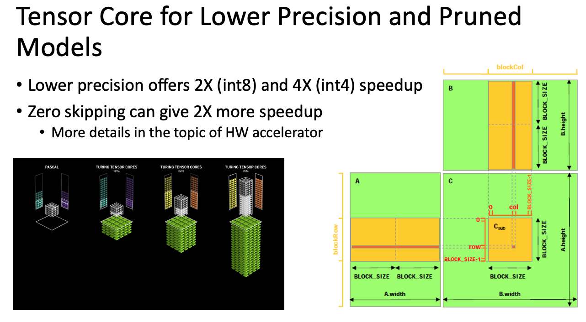

# NPU

```
1. systolic array에서 matmul을 계산하는데 필요한 사이클 수
(array setup + mult + accum + output)
2. TPU v1에서 low DRAM bandwidth 문제를 해결한 방법은?
- weight staionary mode
3. NVIDIA Tensor core에서의 Low precision 방법
4. Zero-skipping에서의 sparse tensor core... 그리기 와우
```

## 1. Systolic Array Architecture (Google TPU, Groq)

### Matrix multiply unit = systolic array

- output stationary
  - vertical --> weight가 들어온다
  - horizontal --> activation이 들어온다

- weight stationary
  - 시스토릭 어레이의 각 MAC 유닛이 세로로 들어오는 weight를 미리 들고있는다
  - horizontal --> activation이 들어온다
  - vertical --> multply, accumulate 결과를 아래로 전달한다
  - **low bandwidth memory에서는 output stationary보다 성능이 좋다**

### Systolic data setup

- im2col
  - CNN에서 이미지를 처리할 때 이미지를 matrix column으로 변환하여 처리
  - cuBLAS보다 cuDNN이 중복된 데이터에 대한 캐시처리 효율이 좋다

### Unified internal buffer

- partial sum이나 next layer input와 같은 intermediate result를 저장하기 위한 공간

### 통신계산 중첩

- bandwidth를 높여서 통신시간을 줄인다 (혹은 int8 처럼 low precision을 로드해서 bandwidth util을 늘린다)
- 타일 크기를 키워서 계산시간을 늘린다

```
in TPUv4
- 128x128 systolic array --> 32x32 array with 4x4 dot product (하이어라키컬한 디자인)
- CMEM: large buffer

TPUv4로 구성된 슈퍼컴퓨터 클러스터
- 노드간 통신 시간을 줄이기 위해 twisted torus를 사용
```

## 2. Large-scale training and inference (Tesla)

## 3. Tensor core (NVIDIA V100)

Tensor core --> 4x4 matrix multiplication + accumulation

Matmul 계산에 필요한 input과 output matrix를 4x4 sub-matrix로 나누고 tensor core에서 FMA 계산을 처리시킨다


## 4. Zero-skipping (NVIDIA A100, Samsung)

Sparsity is One of Main Issues in AI Chip Design

### Pruning

- we consider their weight as zero
- 0과 가까운 weight를 0으로 처리해서 보는 것
- pruning 후에 negative impact를 줄이기 위해서 re-training
- 이 과정을 반복적으로 수행하여 quality loss를 줄임

2:4 compress --> 4개 elem 중에 2개에 대해 zero 처리

### Feature-map-aware zero-skipping


## 5. Low precision (NVIDIA, IBM)

### Quantization
Reducing bit width of weight and activation

- float32
- float16
- bfloat16 --> float32에서 matissa만 줄이고 exponent는 유지 (수를 표현할 수 있는 범위는 유사하나 정확도가 낮은거)

> H100에서 FP8도 가능!


### Outlier-aware quantization

precision을 그냥 줄이면 outlier들에 의해 에러가 발생함

outlier 데이터 (1~3%)를 다른 데이터들과 별개로 처리한다
- outlier: high precision 사용 (16bit)
- majority: reduced precision 사용


### 성능 향상


