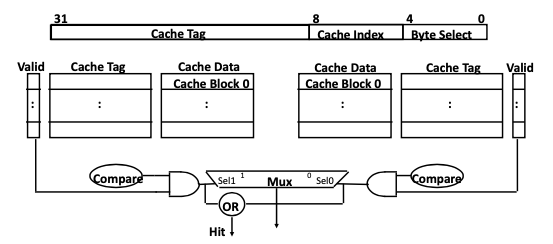
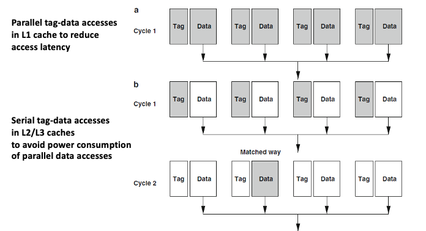
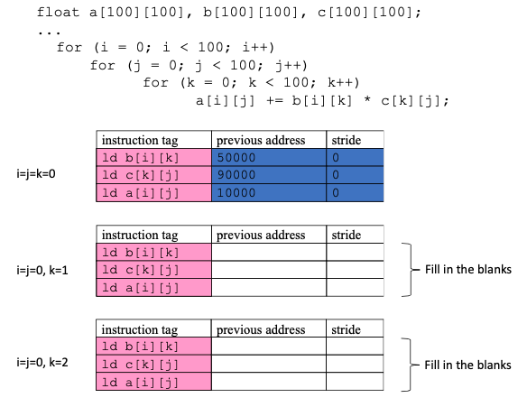

# Midterm

- 강의자료에서 큰 그림에 대해서는 확실하게 이해할 것
- 문제가 아예 똑같이 나옴!

## Baisc Concept

**1.1 Three dependencies in instruction level parallelism**

- True dependence
- Anti dependence
- Output dependence

**1.2 Explain how to improve the performance of thread level parallelism (TLP) on GPU**

- Memory latency hiding by multi-threading
- Cache Blocking
- Data layout & memory request coalescing

**1.3 Global and local branch history in branch prediction**

**1.4 Serial tag-data accesses in the cache**

**1.5 Miss state holding register (MSHR)**

**1.6 Non-blocking cache**

**1.7 Directory-based cache coherency protocol**


## ILP problem 1 (2회)

**2.1 Fill in the table of instruction status with clock cycle numbers from 2 to 22.**

**2.2 Explain why the last instruction “ADDD …” is issued a few cycles later than the previous instruction “DIVD …” (not immediately after the issue of DIVD).**

- DIVD가 issue 된 직후에는 SUBD instruction이 Add FU를 차지하고 있기 때문에 SUBD instruction이 끝날 때 까지 stall이 걸린다.

**2.3 Explain why the execution of the last instruction “ADDD …” finishes at cycle 22 (not earlier).**

- ADDD 명령의 execute는 16 사이클에서 다 끝나지만, F6 레지스터에 write할 때, DIVD의 F6 read가 먼저 발생해야하기 때문에 WAR hazard에 의해 stall이 걸린다.

```
Scoreboard 달달 외울 것! ppt 나온대로!
```

## 3. ILP problem 2 (2회)

**3.1 Fill in the table of instruction status with clock cycle numbers from 2 to 16.**

**3.2 Explain why the last instruction ADDD can finish write result earlier than some other instructions in terms of instruction issue and write result.**

- ADDD 명령은 reservation station에 available FU가 존재하여 DIVD가 issue된 직후에 바로 issue가 가능하다.
- DIVD 명령이 issue 될 때 F6 레지스터의 값을 복사해오는 renaming을 수행하기 때문에 ADDD 명령은 WAR hazard를 고려하지 않고 바로 F6 레지스터에 write를 수행할 수 있다.

**3.3 Tomasulo on loop with branch prediction. Assume a branch prediction is adopted and fill in the blank rectangles with cycle numbers in the following table.**

```
토마슐로 순서 / 토마슐로 + Branch Prediction 달달!
```

## 4. Basic cache architecture (2회)

**4.1 Given an address bit configuration shown above, explain how the desired data block can be read from the cache in case of cache hit.
Use the given figure and draw missing parts to explain the cache hit operation.**



1. cache index를 이용해서 set entry를 찾는다
2. set의 각 way의 tag와 address의 tag가 동일한 지 비교한다
3. valid bit가 1이고 tag가 동일하면 cache hit이 되어 cache block을 출력한다

**4.2 Explain what cache conflict miss is and give a solution (among many) to reduce conflict misses.**

- conflict miss는 데이터가 cache entry에 들어가게 될 때 이미 다른 데이터의 캐시가 들어있어 conflict이 나면서 발생하는 cache miss이다.
- The cache conflict miss occurs when more entries are accessed on a cache set than the associativity.
- set의 way 수를 늘려준다 / victim cache entry를 둔다
- The solutions will include victim cache, higher associativity (including pseudo associativity), prefetch, better replacement, ...

## 5. Way prediction in cache

**1.4 Explain serial tag-data accesses in the cache**



## 6. Non-blocking Cache

**1.6 Explain Non-blocking cache**
- Non-blocking cache는 MSHR(Miss State Holding Register)를 이용해서 miss penalty 동안 cache request를 계속 처리한다.

**1.3 Explain “miss under miss” in cache operation. (2.5 points)**

- MSHR을 이용하여 cache miss가 발생할 때 다음 cache request를 계속 처리할 수 있도록 하며
- cache miss를 overlapping 시켜서 average miss penalty를 줄여 memory access latency를 줄일 수 있다

**4.1 Explain the function of MSHR and its effect on memory access latency.**

- MSHR은 cache miss가 발생하였을 때 miss request 정보를 저장하는 레지스터로,
- cache miss가 발생할 때 다음 cache request를 계속 처리할 수 있도록 하며
- cache miss를 overlapping 시켜서 average miss penalty를 줄여 memory access latency를 줄일 수 있다

## 7. Cache prefetch

**5.1 Assume the size of four bytes for a float type data. Fill in the blanks.**



- 50004 4, 90400 400, 10000 0
- 50008 4, 90800 400, 10000 0

**5.2 How to calculate prefetch accuracy during runtime**

- prefetch accuracy = # of useful prefetch / total prefetch
- 여기서 useful prefetch는 prefetch를 한 이후에 실제 접근까지 한 prefetch 데이터를 의미한다.
- 이를 측정하기 위해 prefetch flag, access flag를 사용하며, cache evict 시점에 두 flag가 모두 1일 때 useful임을 확정한다

**5.3 Explain adaptive prefetch using the case in problem 5.1**

- prefetch degree = prefetch할 데이터의 양
- prefetch distance = prefetch할 데이터의 stride
- prefetch accuracy를 runtime 중 측정하여 aggresivness(degree, distance)를 조정한다
- e.g. accuracy가 높으면 aggresiveness를 높인다.

## 8. Cache Coherence

- MESI protocol

## 9. Cache Partitioning


## 5. Memory Problem 1

- 4 bank DRAM

## 6. Memory Problem 2

- DRAM 칩...

## DRAM refresh

## Virtual Memory
