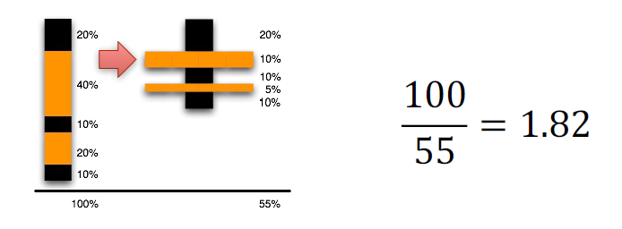
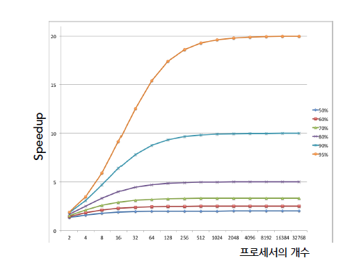

# 1강 Current Trends

HPC == Accelerator Computing

우리나라는 슈퍼컴퓨터보다 모바일 디바이스, 임베디드에 대한 연구를 많이 함  
근데 슈퍼컴퓨터에서 먼저 연구가 된 다음에 모바일디바이스로 내려와야 함

## 1. 멀티코어의 등장배경

### Moore의 법칙

무어의 법칙이란?  
트렌지스터의 개수가 18개월마다 2배로 증가 --> 이는 곧 성능의 증가

> 무어는 인텔 창업자

cpu clock frequency가 증가한다 --> 같은 시간동안 처리하는 instruction 수가 증가

하지만 무어의 법칙은 죽었다
  - ILP Wall
  - Power Wall: frequency는 2000년대부터 saturated (발열량 때문에)

이를 해결하는게 멀티코어! (코어를 여러 개를 두어 해결하자!)

무어의 법칙 자체는 계속 되고있다: `남는 트렌지스터로 멀티코어`를 하고 있다

### 하드웨어를 이용한 성능향상 기법

- instruction pipeline
- out-of-order execution
- superscalar execution
- on-chip cache

> 앞으로 배울 것

### ILP Wall

ILP(Instruction Level Parallelism) 란?
- Application 자체의 특성으로
- 하나의 프로세서에서 `동시에 실행될 수 있는 instruction의 평균 갯수`
- 이는 instruction 간의 dependence에 영향을 받는다

ILP를 높이면 성능을 높일 수 있다.

하지만, instruction은 선행 instruction에 대해 dependence를 갖는 경우가 많기 때문에 동시에 실행할 수 있는 instruction이 많지 않음

--> ILP wall

즉, 프로세서가 4개의 instruction을 동시에 실행할 수 있다하더라도 ILP가 2.8개라면 하드웨어 낭비다 (3개만 둬도 될테니)

프로세서 하나에서 돌릴 수 있는 ILP는 제한적이니, 프로세서를 여러 개 두자!

**==> 멀티코어를 하자!**

### Power Wall

- CPU 계산속도를 높이기 위해 CPU frequency가 높아야 해
- 근데 frequency가 높으면 전력소모량도 높아짐 (발열량 up)
- 즉, frequency를 무한정 높일 수 없음.

**==> 멀티코어를 하자!**

### 결론은?!

무어의 법칙에서 트랜지스터의 갯수가 증가해도 이제 성능이 비례해서 증가하지 않는다. --> 기존 무어의 법칙은 죽었다

트렌지스터의 갯수가 증가하니 남는 트렌지스터로 멀티코어를 하자

새 무어의 법칙 --> 한 개의 칩에 집적된 코어의 수가 18개월마다 2배로 증가

포스트 무어 시대의 우리의 연구주제...
- 가속기: GPU, FPGA, 퀀텀컴퓨팅

> 참고로 퀀텀컴퓨팅을 기존 컴퓨터를 대체하는 개념으로 오해하는 경우가 많은데, 그게 아니라 가속기의 개념으로 생각해야 함

## 2. 병렬 시스템

### 클러스터

자체 운영체제를 실행하는 노드들을 고속 네트워크 연결을 통해 하나의 클러스터로 구성 (e.g. Infiniband/100G ethernet)

- scale-up: 노드 하나의 성능 향상
- scale-out: 노드를 더 붙여서 성능 향상

> 성능의 표현  
64비트로 표현할 수 있는 정보의 양은 finite
--> approximate해서 floating point를 표현해야 한다  
flops: 1초당 계산할 수 있는 floating point operations

### 이종컴퓨터 시스템

서로 다른 프로세서를 혼용하는 컴퓨터 시스템

범용 프로세서(CPU)와 가속기(accelerator)를 혼용
- 범용 프로세서는 운영체제(자원관리)를 돌리고
- 가속기는 특정한 작업을 가속 (e.g. GPU로 딥러닝 시스템을 가속)

**FPGA?**

Field-Programmable Gate Array

얘도 하나의 가속기. 원래 칩을 프로토타입핑하는데에 썼다 --> 근데 얘를 직접 사용하게 됨

> inference 쪽에서 잘 쓰이고,
> training 쪽에서는 GPU를 이기기 쉽지 않음

FPGA는 개발자가 verilog 같은 하드웨어 언어를 써서 하드웨어를 재구성하도록 설계되어있음 --> 일반 사용자에겐 진입장벽이 높음

### 이종클러스터 시스템

클러스터 시스템에서 각 노드가 가속기를 장착한 경우

현재는 GPU 기반 hetrogeneous cluster가 보편적으로 사용됨

딥러닝의 경우 GPU 기반의 이종 시스템이 표준이 됨

### GPU 기반 시스템에서의 프로그래밍

- CUDA
- OpenCL

쿠다가 사람들이 훨씬 많이 씀

그렇다고 openCL이 없어지냐? No.  
--> 범용성을 고려한다면 (AMD에서도 돌아가고 Nvidia GPU에서도 돌아가는 프로그램을 만들어야 한다면) openCL을 선택

cuda는 엔비디아 독점이라 연구가 힘들어서
천둥연구실은 주로 openCL로 연구를 진행하고 있음

> 현재는 pytorch나 tensorflow 돌릴 때 nvidia GPU가 반드시 필요함. 그래서 연구실에서 cuda 기반이 아닌 openCL 기반으로 이러한 AI framework를 돌릴 수 있도록 연구 진행 중

#### 프로그램 구성

- Host: CPU
- Device: GPU (accelerator)
- Kernel: device에서 도는 function (OS의 커널과 다른 개념)

#### 동작 방식

- host program에서 kernel의 실행을 코디네이션 해줌
- host program은 kernel들과 병렬적으로 동작

1. CPU 메모리에서 GPU 메모리로 입력 데이터를 복사
2. GPU 코드(kernel) 수행
2. GPU에서 나온 결과를 CPU 메모리로 복사

#### CUDA, OpenCL, MPI

GPU 제조사에서 직접 프로그래밍 모델과 라이브러리들을 제공
- 프로그래밍 모델: CUDA, OpenCL, OpenACC...
- 라이브러리: cuDNN, cuBLAS, NCCL, RDMA ...

> 라이브러리의 경우 굉장히 high-level을 제공 --> 이 강의에서 배우진 않을 것

현재 OpenCL, CUDA 구현은 하나의 노드에서 여러 GPU에 대한 병렬 처리를 목표로 함

이종 클러스터에서의 개발을 위해서는 `MPI`를 함께 사용해야 함

### Amdal의 법칙

프로그램을 n개 프로세서로 병렬화 하면 얼마나 빨라질까?

프로그램에서 병렬화가 가능한 부분이 p라고 하면,  
`1/((1-p) + p/n)`

- 1-p: 순차실행하는 부분
- p/n: 병렬실행 되는 부분을 프로세스 수만큼 나눈거

위의 식을 계산해보면 p가 95%라고 해도 어느순간부터 성능향상이 없어짐 --> 5% 때문에 생기는 병목!

##### Amdal의 법칙이 의미하는 바

- Speedup은 프로그램 내에서 병렬화할 수 없는 부분이 차지하는 실행 시간에 의해 주된 영향을 받음
- 이는 병렬 프로그래밍의 한계를 암시한다
- 순차실행하는 부분도 빠르게 돌릴 수 있어야 한다 --> frequency를 높여야 한다
- 즉, 병렬실행을 아무리 잘 하더라도 순차실행을 빠르게 하는 프로세서도 있어야 좋다

## 3. Programming Model

### Programming Wall

하드웨어 구성이 아무리 잘 되어있어도, 소프트웨어 자체가 병렬화를 잘 해야 성능이 올라간다

### Programming Model

응용프로그램을 개발할 때 프로그래머와 병렬 컴퓨터 시스템 간의 인터페이스(interface)

e.g. 프로그래밍 언어, 라이브러리, 컴파일러 directive 등

프로그래밍 모델이 쉬우면 하드웨어를 잘 컨트롤하기 어려워지는 경향이 있음
--> 이 둘의 밸런스를 맞추기 쉽지 않음

#### 종류

Shared Memory 기반
- OpenMP
- Pthreads

Message Passing 기반
- MPI

Accelerator
- OpenCL
- CUDA
- SnuCL: MPI 안쓰고 클러스터 프로그래밍

> Q. 왜 C/C++로 프로젝트를 하나요?  
A. 현재 python으로 제공된 라이브러리들도 결국 밑단에는 다 C/C++로 구현되어있음

## 4. AI에 대하여

### AI? Deep learning!

요즘 잘 되고 있는건 정확히는 deep learning

딥러닝 이론은 이미 30년 전에 나왔다
리소스가 되니까 이제서 뜬...

딥러닝은 **Pattern findings in data**

Three primary directions of DL innovation
- Computer vision
- Game playing
- Natural Language Processing (NLP)

### 초거대 AI

2020년 open AI에서 GPT-3를 발표

GPT-3의 이슈들
- computing power
- memory size
- training data IO size

이건 결국 HPC에서 전통적으로 해오던 연구들..

초거대 AI는 AI 연구가 아니다. HPC 연구다!
