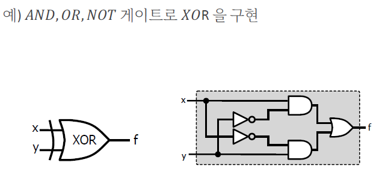
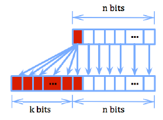
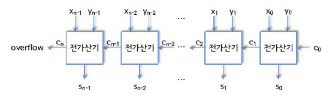
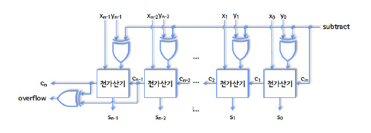

# 3강 Binary Representation

## 1. Singed vs Unsigned

n비트로 2^n개의 서로 다른 이진수를 표현할 수 있다

Unsigned number
- 0을 포함한 2^n개의 양수

Singed number
- MSB를 sign bit로 두어서 0이면 양수, 1이면 음수
  - 하지만 얘는 0이 2개가 되는 케이스
  - 하드웨어에서 0을 2개 처리하는게 복잡함
  - 2의 보수표현으로 해결 (하드웨어 구현이 간단함)

## 2. 보수

- (r-1)의 보수
  - `(r^n-1)-x`
  - 각 자리의 숫자를 (r-1)에서 빼는 것
- r의 보수
  - `r^n-x` (x != 0)
  - x가 0이면 0
  - (r-1)의 보수에서 1을 더함

> r은 기수를 의미, x는 보수를 구할 대상

10진수에서 9의 보수: 각 자리 숫자를 9에서 뺌
```
836의 9의 보수 = 999 - 836 = 163
```

10진수에서 10의 보수: 10^n-1을 하거나 9의 보수에서 1을 더함
```
836의 10의 보수 = 1000 - 836 = 164
```

### 1의 보수

3비트의 이진수에서 0~3의 1의 보수를 구하면 아래와 같음

| 0 | 1 | 2 | 3 |
| --- | --- | --- | --- |
| 000 (0) | 001 (1) | 010 (2) | 011 (3) |
| 111 (0) | 110 (-1) | 101 (-2) | 100 (-3) |

- 각 자리의 숫자를 (r-1)에서 빼는 것
- 각 자리 수를 뒤집으면 됨
- 0을 표현하는 방법이 2가지가 됨 (`000`, `111`)

### 2의 보수

3비트의 이진수에서 0~3의 2의 보수를 구하면 아래와 같음

| 0 | 1 | 2 | 3 | 4 |
| --- | --- | --- | --- | --- |
| 000 (0) | 001 (1) | 010 (2) | 011 (3) | |
| | 111 (-1) | 110 (-2) | 101 (-3) | 100 (-4) |

- 가장 오른쪽에 나오는 1과 뒤따라 나오는 0을 제외한 모든 비트를 뒤집으면 됨
- 가장 오른쪽에 나온 1 직전까지를 뒤집는다
- 1의 보수를 구한 뒤 1을 더하면 됨

## 3. 연산

### mod 연산

유클리드 나눗셈에서는 -7을 3으로 나누면 몫이 -3이고 나머지가 2

#### 합동관계

𝑥 mod 𝑚 = 𝑦 mod 𝑚

`x ≡ y (mod m)`

32개의 bit가 있는데 계산 결과가 32 bit를 넘어가는 경우

- 23/16=7
- 23은 10111
- 근데 우리가 4bit만 써야한다 --> 0111 7이 남음
- 23 ≡ 7 (mod 16)

> 데이터 유실이 아닌가??ㅜㅜ 왜 하는지?

### AND, OR, NOT

AND, OR, NOT으로 사칙연산을 다 할 수 있다

- XOR: x, y 두 비트가 다르면 1이고 같으면 0
- XNOR: 같으면 1이고 다르면 0

XOR도 결국 AND OR NOT으로 표현이 가능

### 논리게이트

boolean 연산을 하드웨어로 표현한 것

- 논리게이트로 boolean 함수를 구현할 수 있음
- 이러한 함수를 여러 개 이어서 n개의 입력, m개의 출력을 만드는 함수를 구현할 수 있음
- 이러한 실제 구현을 abstract 시킨다 --> 블랙박스



### 시프트 연산

- 논리시프트: 0으로 채움
- 산술시프트: 부호표현을 유지하며 채움

> - 왼쪽 시프트는 논리시프트와 산술시프트가 동일
> - 오른쪽 시프트가 논리인지 산술인지는 컴파일러 구현에 따라 다름

#### 왼쪽 shift (곱셈)

m번 shift: 2^m을 곱한 것과 동일

> 부호없는 수와 2의 보수표현에서 모두 적용됨

#### 오른쪽 shift (나눗셈)

- 부호없는 수: 2^m을 나눈 몫
- 2의 보수표현: 산술시프트일 때만 2^m을 나눈 몫 (음수일 땐, 유클리안 디비전으로 생각)

```
1001(-7) --> 1110(-2)

유클리안 계산법으로
-7 / 4 = -2 (mod 1)
-7 = 4*(-2) + 1
```

### 부호 확장

- n비트 2의 보수표현에서 비트 수를 확장시킬 때
- 확장되는 비트를 부호비트로 채운다



```
4비트 2의 보수표현을 6비트로 변환

0101(6) --> 000101(-6)
1101(-3:0011) --> 111101(-3:000011)
```

- 우리가 보수를 구할 때 가장 오른쪽에 나온 1 직전까지를 뒤집는다
- 그러니, 음수의 경우 앞에를 쭉 1로 채워져야 뒤집었을 때 값이 0으로 채워지는 것과 동일해짐

### 덧셈 연산

#### 부호 없는 수

overflow: 두 이진수를 더할 때, MSB에서 나오는 carry가 1인 경우

- overflow 발생 시 2^n 만큼 빼줌 --> `(x+y) mod 2^n`
- 즉, 오버플로 발생 시 덧셈 결과로 나온 n+1개 비트 중 하위 n개 비트를 취하고 MSB를 무시
- 즉, 합동관계를 취한다!

```
 1 1 1 1
   1 0 1 1
+  0 1 1 1
-----------
 1 0 0 1 0

11 + 7 = 18
18 ≡ 2 (mod 16)
```

#### 2의 보수표현

overflow: 더하는 과정에서 `MSB로 들어가는 carry`랑 `MSB에서 나오는 carry`가 서로 다른 경우

- e.g. x, y의 부호비트가 동일한데 MSB의 carry가 다를 때

```
 '0' '1' 1 1
      0  1 1 1
+     0  1 1 1
---------------
      1  1 1 0

7 + 7 = 14
14는 4비트 보수로 표현할 수 없음 (7이 최대)
```

-   양수로 오버플로우: 2^n만큼 빼줌
-   음수로 오버플로우: 2^n만큼 더해줌

> 이거 왜 배우냐? 덧셈 하드웨어를 구현하기 위해서!

#### 하드웨어 구현

AND, OR, NOT (functionally complete set): 이 3개로 회로를 구현할 수 있다

> complete set의 조합은 다양함

-   반가산기 (half-adder): 2개 비트 덧셈하는 회로 (x, y)
-   전가산기 (full-adder): 3개 비트 덧셈하는 회로 (x, y, carry)

가산기 자체가 자세히 어떻게 생겼나를 신경쓰지 않고 abstract 시킴

전가산기 n개를 이용해서 n비트의 unsigned 덧셈 하드웨어를 구현할 수 있다



> 부호 없는 수와 2의 보수표현은 overflow 감지 방법만 다름

### 뺄셈 연산

#### 부호 없는 수
십진수 뺄셈과 동일

```
 0 1 0 0
   1 0 0 1
-  0 1 0 1
-----------
   0 1 0 0
```

#### 2의 보수표현
y의 2의 보수를 더해주는 것과 동일

```
x-y = x+(-y) = x+y'+1
```

#### 하드웨어 구현

덧셈에서처럼 반감산기과 전감산기를 구현할 수 있음

2의 보수표현에서는 감산기를 따로 구현할 필요 없이 가산기를 이용해서 구현할 수 있음



- `subtract`값이 0이면 덧셈, 1이면 뺄셈을 수행하는 연산기
- `subtract`가 1이면 y의 1의보수가 되고 cin이 1이 들어가서 1을 추가로 더해주는 형식이 됨

**이런게 바로 ALU에 들어가는 덧셈,뺄셈 하드웨어이다.**

> 근데 저 연산기가 실제로 들어가는건 아니다?? 비효율적이래

### 곱셈 연산

#### 부호 없는 수

십진수 곱셈과 동일 `37p`

이진수의 곱셈에서 1비트 곱셈의 결과는 무조건 0이나 1이기 때문에 carry가 발생하지 않음

> 곱하기지만 AND 연산으로 표현할 수 있다

Unsigned 곱셈 하드웨어도 덧셈 하드웨어만 있으면 구현이 가능 `38p`

> 예전엔 곱셈기가 덧셈기보다 비쌌다. 근데 요즘은 많은 최적화가 적용되어서 덧셈기와 곱셈기가 거의 또이또이

#### 2의 보수표현

얘도 마찬가지로 덧셈기로 구현 가능

### 나눗셈 연산

#### 부호 없는 수

-   십진수 나눗셈과 동일
-   y가 x에 몇 개 들어있는 지 반복해서 빼보는 것
-   23 / 4 --> 23-4를 총 5번 할 수 있다

#### 2의 보수표현

-   절대값으로 unsigned 나눗셈 수행
-   x와 y의 부호가 다르면 몫을 -로 취함
-   x<0 이면 나머지를 -로 취함

내용이 복잡하지만 결론은,
**나눗셈의 하드웨어도 감산기를 이용해서 만들 수 있다!**

> 아직까지 나눗셈은 덧셈기 곱셈기보다 10배 이상 느리다

### 정리

AND OR NOT 게이트로 2의 보수표현에 대한 덧셈, 뺄셈, 곱셈, 나눗셈을 할 수 있는 하드웨어를 만들 수 있다는 것

특히 음수를 표현할 수 있고 덧셈을 계산할 수 있으면 나머지도 표현이 가능하다

CPU의 ALU 안에 이러한 연산기들이 들어가 있는 것

> Control Unit 만드는건 조금 복잡..

> 지금 보여주는 것은 원리를 이해하기 위한 비효율적인 회로를 보여준 것  
실제로는 특허도 많고 구현체가 다양하다
