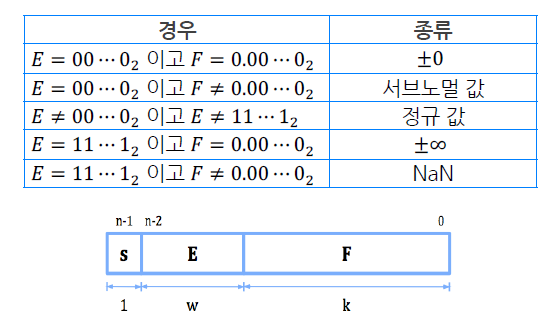
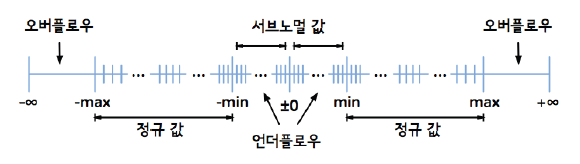

# 4강 Floating Point Representation

## Before start

부동소수점 표현은 매우 중요하다!

왜? 딥러닝 모델에서의 경량화 기법 중 하나인 Quantization

- 32bit representation을 16bit로 줄여서 써도 loss가 적더라! 대신 모델 크기는 반이나 줄어듦

근데 어떻게 정보를 안 잃어버리고 16bit로 줄이는가?
- 이걸하려면 floating point representation을 잘 이해해야

이건 고전 HPC에서 연구해왔던건데, 딥러닝에서 `bf16` `tensorflow16` 이런게 등장하고 있음

이걸 이해하는데 기본이 floating point representation을 이해하는 것

## 과학적 표기법

수를 나타내는 정규화된 과학적 표기법:
```
𝑚 × 𝑏^e (1 <= 𝑚 < 𝑏)
```

얘랑 비슷하게 floating point representation을 한다

```
전자 ∶ 0.00000000000000000000000000000091093822 kg
전자 ∶ 9.1093822 × 10^(-31) kg

지구 : 5973600000000000000000000 kg
지구 : 5.9736 × 10^24 kg
```

## 부동소수점 표현

과학적 표기법을 사용하여 수를 표현하는 부동소수점

같은 bit 수를 사용했을 때 수의 range는 부동소수점 표현이 더 큼

하지만 표현할 수 있는 수의 갯수는 부동소수점과 고정소수점이 동일 (2^n)
- 64bit로 나타낼 수 있는 정보의 갯수는 2^64로 한정되어있음

실수가 주어졌을 때, 이를 부동소수점으로 나타내려면 정확하게 값이 떨어지지 않을 수 있다  
- 어림잡아서 표현해야 함
- 정확도 문제가 발생

## IEEE 754 표준

CPU 벤더마다 부동소수점 표현 방식이 다르면 값이 달라질 수 있다
--> IEEE에서 표준화

> 흔히 딥러닝에서 사용하는건 FP32와 FP16

우리는 FP32를 배우고 이걸 알면 다른 표현도 쉽게 이해할 수 있다

### 32비트 IEEE 754 이진 부동소수점 표현



32비트 시스템에서:
- s: 1bit
- E: 8bit (exponent)
- F: 23bit (fractional)

### 라운딩

아까 실수는 어림잡아 표현한다고 했음

- 라운딩: 더 "적은" 수의 자릿수를 가진 값으로 주어진 수를 어림잡는 작업

그러다보니 실제값과의 오차가 발생할 수 밖에 없다

> 라운딩 규칙을 설정해서 수행
- e.g. 가장 가까운 짝수로 라운딩 / 0에서 먼 수로 라운딩 / +∞를 향한 라운딩 / −∞를 향한 라운딩 등등

#### 이진수의 라운딩

- 이진수 라운딩은 표준에서 **가장 가까운 짝수로 라운딩**하는 것이 규칙
- 즉, 가장 가까운 수 중 LSB가 0인 쪽으로 라운딩

```
소수점 둘째 자리 까지 구하는 경우

- 100.00011: 100.00 이 가장 가까운 수
- 100.0011: 100.01 이 가장 가까운 수
- 100.111: 101.00 / 100.11 중에서 LSB가 0인 101.00으로 라운딩
- 100.101: 100.10 / 100.11 중에서 100.10으로 라운딩
```


### 1. 0의 표현

| s (1bit) | E (8bit) | F (23bit) |
| --- | --- | --- |

- 𝐸 = 00⋯0 이고 𝐹 = 0.00⋯0

```
0   0000 0000   0000 0000 0000 0000 0000 0000
1   0000 0000   0000 0000 0000 0000 0000 0000
```

### 2. 정규값

| s (1bit) | E (8bit) | F (23bit) |
| --- | --- | --- |

- 𝐸 ≠ 00⋯0 이고 𝐸 ≠ 11⋯1

위의 binary에서 아래 식을 표현해야 함
```
(-1)^s x m x 2^e (1 <= m < 2)
```

32비트 시스템에서

- `e = E - bias`
  - e는 -126 ~ +127
  - E는 8비트 (1~254) (0, 255는 제외라서)
  - bias: 127
- `m = 1 + F`
  - F는 소수부를 나타냄
  - 암묵적으로 1과 그 사이의 소수점이 존재함을 가정

#### FP32 to Decimal

| 0 | 1000 1100 | 1011 1111 1010 0100 0000 000 |
| --- | --- | --- |

```c
e = E - bias = 10001100 - 127 = 140 - 127 = 13
m = 1 + F = 1.10111111101001

(-1)^0 * 1.10111111101001 * 2^13 = 1.10111111101001
```

#### Decimal to FP32

-3.141595 x 10^10

1. 정규 과학적 표기법으로 변환
```c
(-1)^1 * 1.110101000010001001010110101011 * 2^34
```

2. 이진수 변환 값이 30bit이므로 23bit(F)로 라운딩
```c
(-1)^1 * 1.11010100001000100101011 * 2^34
```
> 라운딩은 가장 가까운 짝수로 라운딩

3. E를 구함
```c
E = e + bias = 34 + 127 = 161 = 10100001
```

| 1 | 1010 0001 | 1101 0100 0010 0010 0101 011 |
| --- | --- | --- |

> 얘를 다시 decimal로 변환하면 `-3.141593`이 나옴  
> 라운딩으로 approximation을 했기 때문에 오차가 발생하는 것!

### 3. 서브노멀값

| s (1bit) | E (8bit) | F (23bit) |
| --- | --- | --- |

- 𝐸 = 00⋯0 이고 𝐹 ≠ 0.00⋯0

**아주 작은 값을 나타내기 위해서 만들었다**

```
(-1)^s x m x 2^(1-bias) (0 < m < 1)
```

32비트 시스템에서

- `e = 1 - bias`
  - E가 이라면 e는 -126로 고정
- `m = F`
  - 정규값에서는 F 소수부에 암묵적으로 1이 있음을 가정했지만,
  - E가 0이라면 그냥 소수 그 자체로 계산

얘로 나타낼 수 있는 가장 작은 값이 `2^(-149)` `2^-23 x 2^-126`

### 4. 무한대

| s (1bit) | E (8bit) | F (23bit) |
| --- | --- | --- |

- 𝐸 = 11⋯1 이고 𝐹 = 0.00⋯0

IEEE 표준에 무한대에 대한 사칙연산이 정의되어있음

### 5. NaN

𝐸 = 11⋯1 이고 𝐹 ≠ 0.00⋯0

허수, 복소수 (얘는 갑자기 왜 얘기가 나온거지)

### 오버플로우와 언더플로우

오버플로우
  - 값이 커서 정규값으로 나타낼 수 없을 경우
  - +∞나 −∞로 표현됨

언더플로우
  - 값이 너무 작아서 나타낼 수 없는 경우
  - 서브노멀 값으로 라운딩하여 어림잡음



<!-- TODO: 여기부터! -->

### x86 80bit extended precision

96bit를 사용

왜? 80bit라며

alignmet requirement
: int를 표현하려면 주소값은 4byte의 배수여야 함
(하드웨어에서 쉽게 접근하기 위해)

그래서 80비트인데 실제로는 96비트에 저장된다

80비트는 10byte --> not 4의 배수
96비트는 12byte --> 4의 배수

그래서 96bit로 사용하고 앞에는 버린다

> 저장공간은 96bit를 사용하지만 하드웨어는 80bit를 사용하도록 설계되어있기 때문...
계산하는 하드웨어 디자인이 80bit를 쓰도록 설계가 되어있는데... 저장하려다보니 96bit
돈이 없어가지고ㅠ

####

QNaN --> 에러 발생 시키지 않고 일단 계산처리
SNaN --> NaN 발생하면 바로 익셉션을 발생

### 부동소수점 연산
