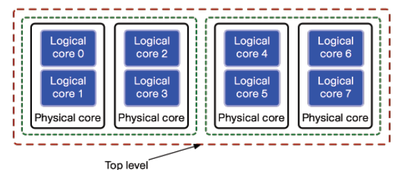

# 프로세스와 쓰레드

## 프로세스

실행중인 프로그램에 이름을 붙인게 프로세스

"stream of instrucion"

- 레지스터
- 메모리
- io status: 파일을 열었는지 등
- signal: 프로세스 간 소통

실행되는 프로그램을 관리하기 위한 데이터 스트럭처

### 커널모드 vs 유저모드

커널모드: 운영체제가 돌아가는 모드

> 커널? 메모리에 상주하는 코드부분 (매번 메모리에 올리는게 아니고)

왜 나눠놨느냐? 시스템의 안정성 및 프로텍션을 위해

### 시스템콜

시스템콜을 호출하면 trap에 걸림 --> 실행에 대한 컨트롤이 os에 넘어가
(trap / exception / fault 동일 의미)

### 멀티프로그래밍

## Virtual Memory

physical memory (DRAM)을 abstraction

DRAM이 1GB 밖에 없는데 마치 1테라를 혼자 쓰는 듯이 abstraction

논리주소공간 vs 물리주소공간

아이디어: 내가 실행하는 코드와 관련된 메모리 공간만 실제 물리 주소에 올리겠다

## Communication

- shared memory를 사용한 통신
- message passing을 통한 통신 (IPC)

프로세스간 통신의 분류에 대한 질문 드립니다.
IPC 방법 중 하나로 shared memory 방식이 있는거로 이해하고있었는데요
통신 방???

## Concurrency

동시성
context switching

Parallel program vs. Concurrent program

둘이 다른 의미!

## Preemptive vs. Cooperative

- Cooperative:
- Preemptive:

## Threads

Fetch - decode - execute 루프가 계속 도는데
그런 루프를 돌고있는 인스턴스 하나르 thread라고 보면 돼

즉 thread는 스케줄링의 대상이되는 unit이다.

우리가 프로세스는 여러 thread로 구성된다고 말하지만

- code
- register
- stack
- thread-local data

얘도 프로세스처럼 user-level thread, kernel-level thread로 나뉜다

thread 안에서는 똑같은 code를 share함 (share 하는 data도 있음)
private 한거는 call stack, PC & register

## 리눅스 스케줄러

### CFS scheduler

#### Completely Fair Scheduler (CFS)

CFS는 시스템의 모든 프로세스에 대한 CPU 시간을 공평하게 분배하기 위해 설계되었습니다.

- 스케줄링 단위로서는 프로세스와 쓰레드가 동일
- 각 프로세서에 run queue가 하나씩 달려있고 거기에 ready 상태의 프로세스가 담김
- Nice value
  - 프로세스들에 priority를 줄 수 있음
  - nice value가 작다 --> process weight가 높다

#### Time Slice
- 프로세스한테 주는 시간
- priority가 높은 친구들에게 time slice를 많이 준다

#### Virtual Runtime
- 각 프로세스가 실제로 CPU를 사용한 시간이 아니라, 사용할 수 있는 CPU 시간의 추정치
- 즉, 각 프로세스가 사용할 수 있는 CPU 시간의 양
- Virtual runtime은 프로세스의 우선순위가 클수록 높게 부여된다.

프로세스의 누적 실행시간은 weight에 반비례한다.

- virtual runtime이 작을수록 프로세서가 더 시간을 필요로 한다
priority가 작을수록 virtual runtime을 적게 준다 (여기 다시 들어야해!!!)

#### Red-black Tree

- self-balanced tree
- Insert 하느 것은 O(log n) 효율적으로 동작함
- 각 프로세서마다 red-black tree로 된 run queue를 가지고
- virtual runtime에 따라서 프로세스를 넣어서 관리한다

virtual runtime이 제일 작은 걸 left-most 노드에 할당을 한다
--> left most 노드를 뽑는거는 O(1)

#### CFS 알고리즘

1. 스케줄링 틱이 일어난다 --> 프로세스 P의 time slice를 깎는다
2. time slice가 0이 되면 flag가 set
3. P의 virtual runtime을 업데이트한다
4. flag가 set되면 P를 preempt 해서 run-queue에 넣는다
5. red-black tree의 left-most 노드의 프로세스를 스케줄링한다.

### SMP scheduling

Symmetric Multi Processing

CFS는 싱글 프로세서에서의 스케줄링 방법
멀티 프로세서 --> SMP 스케줄링

여러 프로세서에 어떻게 일을 분배할거냐?

#### Scheduling Domains

하이어라키컬하게 스케줄링 도메인을 정의해놓고
스케줄링 도메인간의 로드밸런싱을 한다는 것

#### Run-queue Balancing

리밸런싱 틱 (SMP 스케줄링 틱)
- 리밸런싱 틱이 발생할 때 로드밸런싱을 수행
- how? push migration
- 일이 많은데서 적은데로 강제로 옮겨준다.

각 계층의 스케줄링 도메인들이 밸런스가 맞는 지 체크
- 레드블랙 트리의 노드의 갯수를 봐서 일이 많은 지 적은 지 확인

Push migration
- 가장 바쁜 프로세서의 run-queue의 프로세스들을 다른 프로세서의 run-queue로 마이그레이션

Pull migration
- 프로세서의 run-queue가 비었으면 다른 프로세서의 프로세스를 가지고 온다

> 현대 리눅스에서는 push, pull migration 모두 구현되어있음

#### Pros and Cons

프로세스를 A 프로세서에서 B 프로세서로 마이그레이션 시키면
- 장점: 프로세서 간의 로드밸런싱이 가능하다는 것
- 단점: 캐시에 넣어놨는데 프로세스를 다른 코어로 마이그레이션 하게 되면 데이터를 다시 메인메모리에서 가져와야 함 --> 시간이 걸리는 단점

> 질문: 서로 다른 코어의 캐시간 커뮤네키에션을 하지는 않나요?
- shared cache 개념이 있음. 하지만 private cache는 다른 코어가 보지 못 해
- 나중에 cache coherence protocol을 배울 예정
- cache hierarchy: L2(shared cache)에는 데이터가 들어가 있어서 사실 메인메모리까지는 안간다고..
