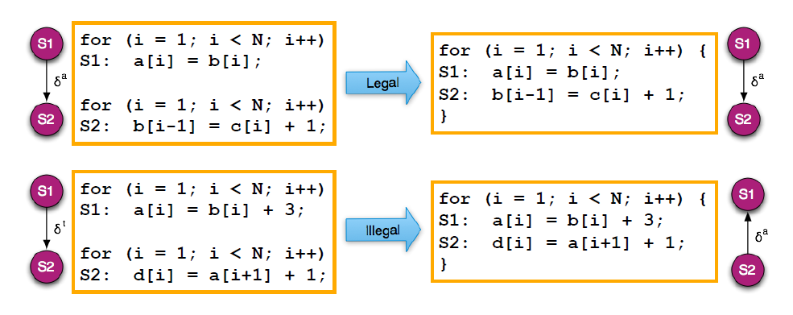

# Loop Carried Dependences

사람들이 루프쪽에 포커스를 하고 있고
데이터 패러렐리즘을 얘기할 때 loop-level parallelism이라고도 한다
(왜냐면 거기서 병렬성이 가장 많이 나오기 때문)

loop iteration 간의 디펜던스를 따지자!

디펜던스가 없다면 loop 자체를 패러렐하게 수행할 수 있다는 것

> 데이비드 쿡...

anti(WAR), output(WAW) dependence는 false dependence다

즉, 없앨 수 있는 dependence다 --> **Renaming**으로 없앨 수 있다!

### Loop independent dependence

루프랑 관계없이 디펜던스가 생기는 것

### Loop Carried dependence

루프 이터레이션 간에 디펜던스가 생기는 것

```
sum = sum + A[0];
sum = sum + A[1];
sum = sum + A[2];
sum = sum + A[3];
```
이렇게 펼쳤을 때 data, anti, output dependence가 생긴다고

### 펀더멘탈

디펜던스를 지키면서 프로그램을 실행하면 무조건 같은 결과가 나온다!

## Loop Transform

루프 트랜스폼의 2가지 방법

1. Loop Fusion
2. Loop Distribution (Fission)

### Loop Fusion
2개의 루프를 하나로 합친다



- 위에꺼는 legal
- 밑에꺼는 fusion하면 dependence direction이 바뀐다 --> illegal!

Fusion하면 뭐가 좋아?
- loop overhead 가 줄어들고
- branching 횟수도 줄어들고
- `b[i]`가 큰 상황을 가정해보면? cache 효율성이 좋아진다

### Loop Distribution

얘는 왜하느냐? --> vectorization 할 때 필요하다

얘도 디펜던시 사이클이 무너지면 illegal

## Parallel Algorithm

패러렐 알고리즘은 reduction과 scan만 알고있으면 된다.

나머지는 결국 다 디펜던스 따지는 것

### Reduction

loop carried dependence --> parallelize 못한다

하지만 partially하게 병렬화가 가능하다!

언제? 교환법칙, 결합법칙, 항등원이 있는 연산이라면!
--> 그걸 리덕션이라고 한다

- `f(x[i])` --> local computation
- `+` --> combine

N개의 연산에 대해 O(logN) 안에 수행이 가능하다

### Scan

얘도 partially parallel한 방법이다

e.g. prefix sum을 계산하는 코드 --> 얘도 루프캐리드 디펜던스를 갖고있다

이거 중요한데..

브랜치가 중요하다 브랜치 다이버전스.. 같은개념?
