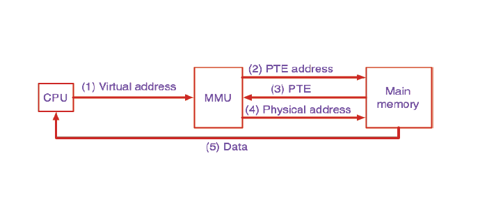
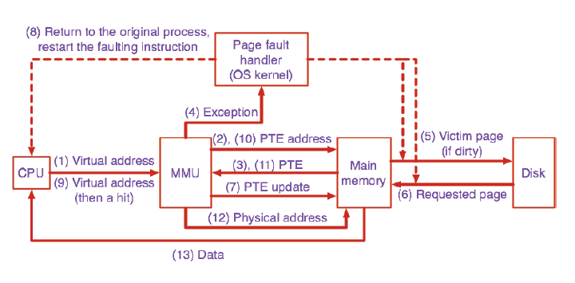
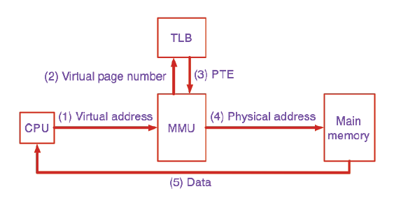
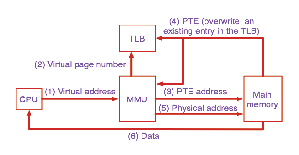

# Virtual Memory

우리는 시스템을 알고 프로그래밍을 해야한다

Virtual Memory는 process마다 abstraction

-   각 process에 physical memory보다 더 큰 memory space를 제공
-   각 process가 memory space를 분리되기 때문에 memory protection

## MMU and Page

- virtual memory와 physical memory를 각각 page size로 나눈다.
- virtual memory의 page와 physical memory의 frame을 맵핑
- physical memory에 꽉 차서 쫓겨난 페이지들은 secondary disk에 저장되며, 이 정보 또한 page table에 기록된다.

MMU: memory management unit
- Virtual address를 Physical address로 맵핑해주는 역할

## Page table

-   Page Table: 맵핑 테이블
-   PTE: page table entry
    -   valid bit
    -   address field (main memory 또는 secondary disk)

swapping?
- secondary disk에서 main memory로 가져오거나 내보내는 것

Demand paging
- 필요할 때 secondary disk에서 main memory로 가져온다는 것
- 필요한 page가 메모리에 안올라와있으면 page fault가 난 것 --> swap in을 시켜야 함

### Address Translation

page number를 table의 index로 쓰는 것

가정: 32bit 머신에서 4KB로 페이징한다.
-   logical memory: 2^32 (4GB)
-   page size: 2^12 (4KB)
-   page 갯수: 2^20 (1MB)
-   page entry size가 4byte라면 page table은 4MB

전체 32bit address에서:
- 12 bit는 offset으로 사용 (4KB)
- 나머지 20 bit가 page number로 사용

page table에서 page number를 frame number로 transfer

프로세스 마다 page table을 가지고 있으며, page table은 메인메모리에 올라가있다

-   PTBR (page table register): 얘는 메인메모리에서의 물리 주소를 갖고 있는 레지스터
-   PTBR + page number로 메모리에서 인덱스를 찾아감

> 요즘 64bit 시스템에서는 memory space가 훨씬 커서 page table도 엄청 크다
--> Multi-level Paging: paging을 hierarchy하게 구성해서 첫번째 page table만 메인 메모리에 올려두고 다음 hierarchy의 page를 메모리에 동적으로 가져오는 식으로 탐색

### Page Hit



### Page Fault



Page fault가 발생하면 OS가 핸들링

- page fault가 발생하면 명령어의 진행을 정지시키고 page fault가 난 위치를 기억시켜서 withdraw
- OS의 page fault를 해결하기 위한 명령어를 실행
- 실행 후에 아까의 명령을 다시 재실행

1. page table의 도움을 받아서 디스크의 page 위치를 찾는다
2. page를 메인메모리의 어디에 넣을 지 정해야 함 (페이지 교체정책)
3. 있던 놈을 뺄 때, dirty bit가 채워져 있으면 write back
4. 디스크의 page를 메모리에 읽어온다
5. page fault가 발생한 명령부터 다시 실행

page fault가 발생하면 메모리 엑세스가 많이 발생하게 된다

### Page Replacement Policies

#### Clock 알고리즘

리눅스에서 사용하는 replacement policy

가장 빈번하게 사용되지 않은 애를 내쫓자! 대략적으로 LRU를 구현한 것

- page를 circular하게 구성
- R(reference) bit를 두고 처음 로드되면 0, 읽어지면 1로 셋팅
- circular하게 서치하면서 제일 처음 R=0인 곳을 replace

## TLB

Page hit를 하더라도 메인 메모리에 엑세스하기 위해서 2번의 메모리 엑세스가 필요하다.
이걸 줄일 수 없을까?

프로세스가 특정 page에 한번 접근하면 locality가 있어서 같은 page 안에서 계속 놀거다
--> 캐싱을 하자

--> TLB (Translation Lookaside Buffer)

> TLB는 MMU 안에 들어가있는 cache다!

TLB는 주로 fully associativity를 사용함 (entry 자체가 별로 안많음)

### Micro-TLB?

TLB도 hierarchy를 두어서 성능을 높인다. (현대에 주로 2단계를 놓고 사용함)

### TLB Hit



### TLB Miss



TLB Miss와 Page Fault가 둘 다 발생할 수 있다

### Context switching과 관련해서

page table은 process마다 있어야 함
각 process의 context 마다 page table이 있어야 함

그럼 context switching이 일어날 때 마다 TLB flush가 발생하는가? --> YES

-   TLB의 모든 엔트리를 invalid 시키자 : 단순하지만 비싸 : P1 --> P2 --> P1 금방 다시 돌아와도 entry가 다 invalid

-   TLB에 pid를 추가하자 : 기존에 가상주소 + 물리주소 로 구성되어있던 TLB 엔트리 : pid + 가상주소 + 물리주소로 구성하고 pid + 가상주소를 태그로 사용하자 : 하드웨어 변경이 필요

### Core마다 MMU가 따로 있나?

각 core별로 MMU를 두면 문제가 발생하지 않지

MMU를 core들에 대해 공통으로 두면 어떤 문제가 발생하는가?

문제가 없다 --> 각 core에서 도는 process 별로 다른 page table base register를 가질테니까

단, 하나밖에 없으니 성능에 문제가 있을 수도 있긴 하다.

이 상황에서 MMU에 TLB가 있는 상황을 생각하면,
TLB는 virtual address가 겹칠 수 있으니 문제가 발생한다. --> 위의 pid로 구분하는 처리를 해주면 해결

현대 대부분은 core마다 MMU를 가지고 있음

## Cache + Virtual Memory

CPU --> () --> MMU --> () --> Memory

cache를 MMU 앞에 두는가 뒤에 두는가에 따라
cache에 저장되는 주소가 physical 일수도 virtual 일수도

- Virtually-addressed cache
  - MMU를 거치지 않으니까 빠르다!
  - 하지만 security issue (protection issue)
    - context switching이 있을 때 cache에 저장되어있는 virtual memory로 access하면서 다른 데이터를 가져올 수 있다
  - 아까 TLB에서 해결한 것 처럼 context switching이 있을 때 마다 flush를 하거나 pid를 추가로 태깅하거나

- Physically-addressed cache
  - flush할 필요는 없다
  - 하지만 address translation을 매번 해야 하니 느릴 수 있다

### 4가지 combination

1. Virtually indexed, virtually tagged
    - cache miss가 나야 address translation
    - TLB access를 cache access와 동시에 할 수 있다.
    - 근데 앞서 얘기했듯이 security issue가 있다

2. Virtually indexed, physically tagged
    - 실제 시스템에서 많이 쓰이는...
    - virtual address로 cache access
    - 그와 동시에 TLB access해서 physical address를 얻고
    - physical address의 tag를 사용해서 비교

3. Physically indexed, virtually tagged
    - 절대 안쓰는...
    - TLB translation이 먼저 일어난 다음에 cache access를 할 수 있음

4. Physically indexed, physically tagged
    - TLB translation이 먼저 일어난 다음에 cache access를 할 수 있음

> 의문점?
> VIVT가 VIPT보다 좋아보이는디...? 미스날 때만 변환되니까 왜 real은 VIPT 인거지?
> 아 근데 처음에 security issue가 있다고 했었구나

> 뭔가 정리하자면 cache에 virtual address를 저장하는게 성능상 좋은데 security issue가 있으니..
> indexing하는 부분에 있어서만 virtual address를 쓰고 실제 저장하는 address는 physical을 쓰자는 것 같아!

### 정리

-   virtually indexed: cache access와 TLB access를 동시에 할 수 있음
-   physically tagged: flush할 필요가 없음

```
P1의 논리주소 a, P2의 논리주소 b

a와 b가 동일한 주소값을 갖고 있다
하지만 P1과 P2는 다른 page table을 갖고 있고
P1의 a와 P2의 b가 가리키는 물리주소는 다르다

그럼 a와 b는 virtualliy 동일한 cache index를 가짐
그러나 두 주소가 변환되었을 때는 이미 tag가 달라져
그래서 physically tagged된 경우에는 굳이 이전 cache 값을 flush 시킬 필요가 없다는 것!

(flush를 굳이 하지 않아도 cache miss가 잘 발생한다)
```
