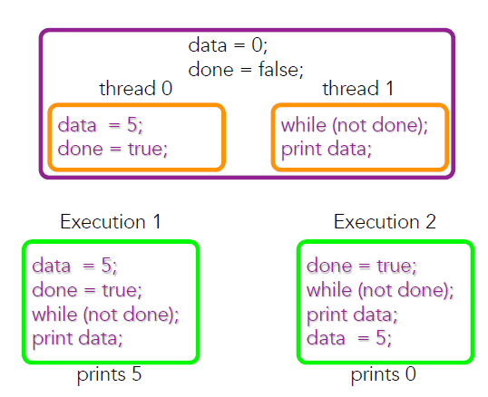
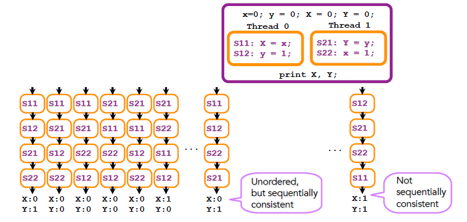

# Memory Consistency

## 메모리 컨시스턴시의 예시

위에서 data와 done은 shared variable임.

우리의 의도대로라면 5가 출력되어야 하는데
- thread 0의 `data = 5;`와 `done = true;`는 디펜던스가 없다
- thread 1의 `while (not done);`과 `print data;`도 디펜던스가 없다
- 컴파일러에서 reordering이 가능해짐! --> Execution2와 같이 0이 출력될 수 있다!

### 이게 coherence problem이냐?

- Coherence: single memory location에 대해서 most up-to-date를 보느냐 아니냐
- Consistency: 여러 개의 access 순서(실행순서) 때문에 일어나는 문제

그럼 뭐로 이 문제를 해결해야하는가?

위 execution 중에 어느 실행이 맞는 지를 기준을 잡아서 얘기해줘야 함

기준? --> 메모리 컨시스턴시 모델

## Memory Consistency Model

Correctness Criteria

- 하드웨어 쪽에서 정해진 모델이 있고,
- 프로그램 언어 레벨에서 정해진 모델이 있다

> e.g. OpenMP에서 flush operation을 써서 consistent한 view를 만드는 거

### Why we define it?

왜 이렇게 consistency model을 만들어서 복잡하게 해놨느냐? --> 최적화를 위해!

- 우리 머리가 생각하는 consistency model을 sequential consistency라고 함
- Sequential consistency를 가정해버리면 하드웨어 최적화가 잘 안된다
- 하드웨어 성능을 높이기 위해 sequential consistency 하고 다른 메모리 모델을 정해서 implement 하는 것

### Sequential vs. Relaxed

- Sequential consistency
  - 우리가 생각하는 가장 자연스러운 연산 순서 모델
- Relaxed memory consistency
  - 여기서 가장 최적화를 잘 할 수 있게 한거
  - e.g. processor consistency, weak ordering, release consistency

## Sequential Consistency

Outcome of a multithreaded program 𝑃 == Single thread executing all operations in 𝑃

Program Order: 소스코드에서의 순서 --> 컴파일러에 의해 하드웨어에서 실행되는 순서와 다르다

### 예시

각 thread에서 실행 순서를 지킨 것이 sequential consistent한 결과임

여기서는 아래 3개 결과가 sequential consistent한 결과임
1. X:0, Y:1
2. X:0, Y:0
3. X:1, Y:0

- `S11 -> S12 -> S22 -> S21`
  - 2번째 thread에서 실행 순서가 바뀌었지만, sequentially consistent하다고 할 수 있음

- `S12 -> S21 -> S22 -> S11`
  - 얘는 결과가 아예 다른게 나와서, sequentially consistent하다고 할 수 없음
  - SC Violation이다!

### SC에 기반한 추론

Sequential consistency를 가정하면,
X가 0일 때 Y는 1이 나올 것이라는 추론을 할 수 있음

### 왜 SC Violation이 생기느냐?

- 각 thread는 순서대로 실행됨
- S11에서 shared memory y에다가 1을 썼는데, memory에 업데이트되는 시간 (bus delay가 발생해서) S22에서 y를 read한 시점보다 늦춰질 수 있다는 것
- 그래서 실제로 순서대로 실행했지만 reordering을 한 것 같은 효과가 나타난다

즉, SC Violation의 원인은 여러 개다!
- 컴파일러가 리오더링
- interconnection network의 딜레이 때문에 업데이트가 늦어지거나

## Relaxed Memory Consistency Models

하드웨어로 SC를 제대로 구현하려면...

Data dependence를 지키면서 program order를 완화한다!
  - `write → write`, `write → read`, `read → write`, `read → read`
  - 이 중 하나를 완화한다

<!-- TODO: 다시다시 -->

메모리 배리어로 instruction의 실행 순서가 바뀌는 것을 방지한다

### Processor Consistency

Relaxing `write → read` order

즉, 앞에 write가 있더라도 read를 먼저 해도 된다는 것

이게 왜 나왔냐?
CPU 쪽에서 write buffer를 개발함

write A ==> read B

read를 먼저하자 어차피 buffer 안에 들어가있으니까?

### Weak Ordering

아까 4가지 order를 다 relax 시켜도 된다. 니 맘대로 해라

하지만, sync operation이라는 것을 지정해서 sync operation 앞뒤로의 순서는 반드시 지킨다

> e.g. OpenMP의 flush가 이거다

The ordering with `sync operation` must be guaranteed!
- `read/write → sync`, `sync → read/write`

### Release Consistency

Weak ordering보다 릴렉스할 수 있다

Weak ordering에서의 sync operation을 2개로 나눴다
1. acquire: lock
2. release: unlock

한번에 하나의 thread만 lock / unlock을 할 수 있다

Acquire and release operations are sequentially consistent!
- `read/write → release`
- `acquire → read/write`

> 22p에서 보듯 sync operation을 둘로 쪼개므로써 Weak ordering보다 완화되었다

#### Release Consistency를 다시 이해해보자

> w(x,5) x에 5를 write 한다
> r(x) x를 read한다

1. x라는 shared 변수가 0이고 2개의 프로세서가 있다
2. r(x): x=0
3. w(x,5)
4. r(x): 3의 write가 아직 메모리에 도달하지 않았으면 0, 도달했으면 5
5. release --> release 앞에 있는 read/write는 무조건 실행이 끝나있어야 함. 즉, release 시점에 5가 무조건 적혀있을 거라는 것
6. r(x): release를 지났기 때문에 무조건 5다
7. w(x,7)
8. r(x): 7의 write가 아직 메모리에 도달하지 않았으면 5, 도달했으면 7
9. r(x): 얘는 같은 프로세서이기 때문에 x에 디펜던스가 있어서 무조건 7이어야 함

> 머지? acquire는 딱히 의미가 없는건강

## OpenMP에서의 Memory Consistency

메모리가 있고 thread마다 메모리를 보는 뷰를 따로 가지고 있다

이런 temporal view가 언제 맞아 떨어지느냐

얘도 결국 relaxed consistency (Weak Ordering) --> flush operation을 할 때 맞아 떨어진다!
