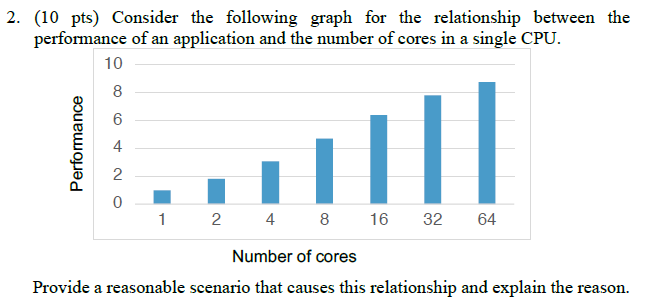
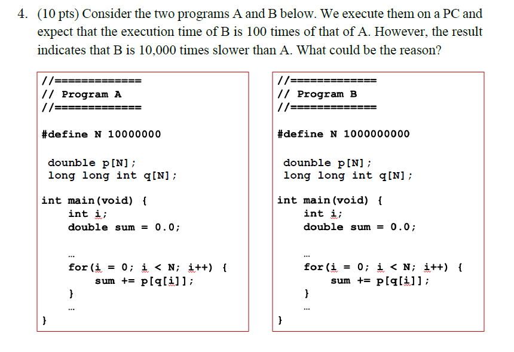

## 1. Current Trends

### 1.1 멀티코어의 등장 배경

기존 Moore의 법칙은 죽었다

- ILP wall
  - 하나의 프로세서에서 동시에 실행할 수 있는 instruction 평균 갯수는 instruction 간의 dependence에 영향을 받는다.
  - single CPU의 core 수가 증가할 수록 프로세서가 동시에 실행할 수 있는 instruction 수는 그에 비례하여 증가하지만, ILP가 제한적이라면
- Power wall
  - CPU frequency를 높이면 발열량도 높아지기 때문에 이를 무한히 높일 수 없다

이를 해결하는 게 멀티코어

### 1.2 Amdal의 법칙



- 프로그램에서 병렬화할 수 없는 부분이 존재하면 Amdal의 법칙에 의해 아무리 core 수가 증가하더라도 speedup은 어느 순간 병목이 생긴다.

> 추가로 core 간 통신 시간이나 cache coherence, memory consistency에 의해 성능향상이 항상 선형적으로 증가하진 않는다

## 2. Floating Point Representation

Perform the following conversions. Assume the default rounding when you consider IEEE 754 floating-point representations.

**1. Convert a decimal number −127 to its 8-bit 2’s complement representation.**

```
127 = 0111 1111
-127 = 1000 0001 (가장 오른쪽 1 이전까지 뒤집는 것 / 2^8 - 127 = 129)
```

**2. Convert a decimal number 3.14 to the IEEE 754 single-precision floating-point binary representation.**

```
3.14

(-1)^0 * 1.1001 0001 1110 1011 1000 010 * 2^1

F = 1001 0001 1110 1011 1000 010
E = 1 + 127 = 128 = 1000 0000
```

| 0 | 1000 0000 | 1001 0001 1110 1011 1000 010 |
| --- | --- | --- |

> 처음에 2진수 변환할 때 정확히 계산해야 함ㅠㅠ

**3. Convert a decimal number 2^−143 to the IEEE 754 single-precision floating-point binary representation.**

```
2^-143

정규값이 표현할 수 있는 e는 -126~127 이므로 서브노멀 값으로 계산해야한다!

E = 000...0
2^-143 = (-1)^0 * m * 2^-126
m = 2^-17
F = 0000 0000 0000 0000 1000 000
```

| 0 | 0000 0000 | 0000 0000 0000 0000 1000 000 |
| --- | --- | --- |

**4. Convert the following value in the IEEE 754 single-precision floating-point binary representation.**

| 0 | 0000 1110 | 1101 0000 0000 0000 0000 000 |
| --- | --- | --- |

```
e = E - 127 = 14 - 127 = -113
m = 1 + f = 1.1101 = 1 x 2^0 + 1 x 2^-1 + 1 x 2^-2 + 1 x 2^-4

2^-113 + 2^-114 + 2^-115 + 2^-117
```

**5. Convert the following value in the IEEE 754 single-precision floating-point binary representation.**

| 0 | 0000 1110 | 1011 0000 0000 0000 0000 000 |
| --- | --- | --- |

```
e = E - 127 = 14 - 127 = -113
m = 1 + f = 1.1011 = 1 x 2^0 + 1 x 2^-1 + 1 x 2^-3 + 1 x 2^-4

2^-113 + 2^-114 + 2^-116 + 2^-117
```

## 3. Dependences

```c
for (i = 0; i < N-1; i++) {
  A[i] = B[D[i]] + 3;       // S1
  if (i < N/2)              // S2
    C[i] = A[i+1];          // S3
  B[D[i]] = A[i] * B[i];    // S4
  A[i+1] = B[D[i]]+C[i];    // S5
}
```
**(a) Find all potential dependences in the code and specify their types**

- loop independent dependence
  - flow dependence
    - S1 --> S4 `A[i]`
    - S4 --> S5 `B[D[i]]`
    - S3 --> S5 `C[i]`
  - anti dependence
    - S3 --> S5 `A[i+1]`
    - S1 --> S4 `B[D[i]]`
  - control dependence
    - S2 --> S3
- loop carried dependence
  - flow dependence
    - S5 --> S4 `A[i+1]`
  - anit dependence
    - S3 --> S1 `A[i+1]`
  - output dependence
    - S5 --> S1 `A[i+1]`

**(b) Can you parallelize the code without any code transformation? Explain the reason.**

code transformation 없이 병렬화할 수 없다.
loop carried dependence가 있어서 loop-level parallelism이 불가능하기 때문

```c
for (i = 0; i < N-1; i++) {
  A[D[i]] = B[i] + 3;       // S1
  if (i < N/2)              // S2
    C[i] = A[D[i]+1];       // S3
  B[i] = A[i] * B[i];       // S4
  A[D[i]+1] = B[i+1]+C[i];  // S5
}
```
**(a) Find all potential dependences in the code and specify their types**

- loop independent dependence
  - flow dependence
    - S3 --> S5 `C[i]`
  - anti dependence
    - S1 --> S4 `B[i]`
    - S3 --> S5 `A[D[i]+1]`
  - control dependence
    - S2 --> S3
- loop carried dependence
  - anit dependence
    - S5 --> S4 `B[i+1]`

**(b) Can you parallelize the code without any code transformation? Explain the reason.**

code transformation 없이 병렬화할 수 없다.
loop carried dependence가 있어서 loop-level parallelism이 불가능하기 때문

## 4. Multithreaded Architecture

**1. Is an SMT processor suitable for data parallelism? Explain.**

- SMT는 data parallelism에 적절하지 않다
- SMT는 하나의 프로세서에서 여러 개의 스레드를 병렬적으로 처리하여 throughput을 늘릴 수 있다.
- 하지만 동일한 FU를 사용하는 instruction이 동시에 issue 되더라도, FU가 한정적이므로 dispatch를 동시에 할 수 없다.
- 따라서 동일한 instruction을 여러 data에 병렬화 시키는 data parallelism은 SMT 프로세서에서 적절하지 않다

**2. What are the pros and cons of the simultaneous multithreading architectures compared to the superscalar and out-of-order processors?**

- 기본적으로 out-of-order가 적용된 superscalar 프로세서에서는 n개의 instruction을 동시에 issue할 수 있다
- 하지만 single thread의 ILP wall에 의해 n개를 동시에 issue하지 못하면 낭비되는 slot이 생기게 된다.
- SMT 아키텍처에서는 하나의 프로세서에서 여러 개의 thread를 병렬적으로 처리할 수 있게 하여 단순 superscalar에 비해 throughput이 높일 수 있다.
- Remove both horizontal and vertical waste, more fully utilize the issue width
- 하지만, thread 별로 context를 관리하는 register를 가지도록 하드웨어가 구현되어야 함
- 여러 instruction이 동시에 issue될 수 있어도 FU가 한정적이라면 동시에 dispatch 하기 어렵다

## 5. Cache



- Spatial locality를 위해 block 단위로 cache에 데이터를 저장한다.
- `q[i]`는 반복문에서 array의 연속적인 index를 가져오기 때문에 cache hit rate이 높지만
- `p[q[i]]`는 반복문에서 연속적인 index를 가져오는 것이 아니라서 cache miss가 발생할 확률이 높아진다.
- 따라서 반복문 수는 100배 많지만, cache miss penalty를 고려하면 실행 속도는 10000배가 될 수 있다.

**2. A direct mapped cache can sometimes have a higher hit rate than a fully
associative cache with an LRU replacement policy (on the same reference
pattern). Is this true? If so, give an access pattern that proves it.**

7. directed mapped cache가 fully associatvie cache보다 hit rate가 큰 상황은 언제인가? (2회)
- 프로그램이 접근하는 spatial data가 cache size보다 클 때?

## Virtual Memory

5. trashing에 대한 설명..?

6. VIPT의 장점에 대해 설명

8. virtual memory는 전체 사이즈가 physical memory보다 작을 때에도 유용함. 왜?

4. virtual memory
- virtual-to-physical address translation이 캐시 전에 발생하였을 때의 pro and cons
- virtual-to-physical address translation이 캐시 후에 발생하였을 때의 pro and cons

## Cache Coherence

7. false sharing에 대해 설명하고 예시 상황을 설명하라

## Memory Consistency

8. 메모리 컨시스턴시 모델 별로 변수 값을 써라 (2회)
