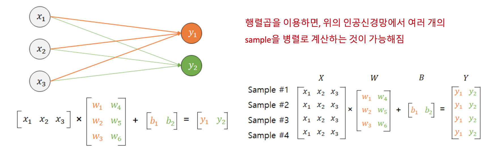
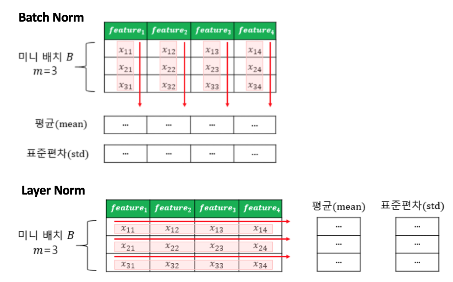

# Machine Learning 개요

머신러닝 데이터
- train data: 학습용 데이터
- test data: 평가용 데이터
- validate data: 하이퍼파라미터 조정을 위한 검증용 데이터

> 하이퍼파라미터: 모델 성능에 영향을 주는 사람이 지정하는 변수
> 파라미터: 모델의 weight, bias

머신러닝 문제는 크게 regression / classification 으로 나뉜다.
classification은 또 binary / multi-class로 나뉜다.

- Linear Regression: 연속적인 값의 범위 내에서 값을 예측
- Logistic Regression (Binary Classification): 2개의 선택지 중 하나를 선택
- Softmax Regression (Multi-class Classification): 3개 이상 중 하나를 선택

## 1. Linear Regression

- linear 함수
: 주어진 독립변수에 대한 y와의 관계를 연속적인 식으로 나타냄

### Cost function (Loss function)

실제값~예측값 오차에 대한 식 --> 가장 작아야 한다

주로 `MSE`가 사용 (Mean Squared Error)

오차를 단순히 "실제값 - 예측값"으로 정의하면 음수, 양수값이 혼재됨.
크기를 구하기 위해 제곱한 값을 사용

### Optimizer

loss가 가장 작은 parameter를 찾아 최적화

`Gradient Descent` --> loss function의 미분값이 0이 되는 쪽을 향해간다

## 2. Logistic Regression (Binary Classification)

이진분류의 경우 연속적인 방정식으로 표현할 수 없음

- `Sigmoid 함수`
: 0~1의 값을 가지는데 0.5 이상이면 true, 이하면 false를 부여하여 이진분류 해결

### Cost function

여기서는 MSE를 사용하지 않음. --> 로지스틱에서는 로컬 미니멈에 빠질 확률이 높아서

`Cross Entropy`를 사용 --> 크로스엔트로피의 평균을 사용!!

실제값이 0일 때 y값이 1에 가까워지면 오차가 커짐
실제값이 1일 때 y값이 0에 가까워지면 오차가 커짐

이 둘을 모두 표현하는 함수 --> 크로스엔트로피 함수

## 3. Softmax Regression (Multi-class Classification)

k차원의 벡터를 입력받아 각 클래스에 대한 확률을 추정
다 합쳐서 1이 나오게...

- `Softmax 함수`
: 여러 개의 연산 결과를 정규화하여 모든 클래스의 확률값의 합이 1이 됩니다

```py
y = np.exp(x) / np.sum(np.exp(x))
```

### Cost function

`Cross Entropy`를 사용

---

# Deep Learning 개요

## 1. Perceptron

- SingleLayer Perceptron
  - input layer와 output layer로 구성
- MultiLayer Perceptron (MLP)
  - hidden layer가 1개 이상

그중에서도 hidden layer가 2개 이상인 경우 `Deep Neural Network (DNN)` 이라고 부름

## 2. Activation Function

퍼셉트론에서 출력값을 결정하는 함수

활성화 함수는 Non-linear function

> 활성화 함수가 linear하다면 (최고차수가 1이라면) hidden layer를 쌓는게 사실 의미가 없음 (linear를 여러 개 쌓는건 하나의 layer로 처리할 수 있으므로)

1. Step Function
  - 거의 사용되지 않음

2. Sigmoid
  - Sigmoid 함수 전체적으로 미분값(기울기)가 0.25보다 큰 값이 나오지 않음
  - back propagation 과정에서 0과 가까운 값이 누적으로 곱해지면서 앞단에는 미분값이 전달이 잘 되지 않는 현상이 발생
  - 이 현상이 `기울기 소실 (Vanishing Gradient)`
  - 그래서 sigmoid는 hidden layer에서는 잘 사용되지 않는 활성화함수임
  - 주로 output layer에서 binary classification 문제를 해결할 때 사용

3. Hyperbolic Tangent
  - sigmoid랑 비슷한데 범위가 -1~1 임
  - sigmoid보다 기울기가 전체적으로 커서 미분할 때 sigmoid보다는 전반적으로 큰 값이 나옴

4. ReLU
  - 음수는 0, 양수는 x
  - 양수일 때 미분값이 항상 1
  - 음수일 때는 0이기 때문에 이 뉴런은 다시 회생하지 못함 --> dying ReLU
  - 이를 보완하기 위해 변형 ReLU들이 등장 --> 그 중 하나가 Leaky ReLU (음수일 때 작은 기울기를 적용)

5. Softmax
  - 얘도 output layer에서 사용되는 것이 일반적
  - multi-class classification 문제를 해결할 때 사용

## 3. 행렬곱에서의 병렬연산

인공 신경망이 입력층에서 은닉층을 지나 출력층에서 예측값을 계산하기까지의 과정을 행렬 연산으로 가정하고 행렬의 크기를 추정해보자.



input dimension이 3, output dimension이 2인 신경망

3x2의 weight와 2의 bias, 총 8개 parameter 값을 구해야 한다.

### training이란?

Training 과정을 통해 예측값과 실제값으로부터 오차를 계산하고, 오차로부터 weight와 bias를 업데이트해야 함.

업데이트를 위해서는 기존과 반대의 방향으로 연산을 진행해야 함 --> `Back Propagation`

### Batch, Epoch, Iteration


- Epoch
  - 전체 데이터에 대한 한 번의 훈련 횟수
  - 즉, 50 epoch이란 전체 데이터로 총 50번 학습했다는 것
  - 문제지를 총 50번 풀었다

- Batch Size
  - batch는 parameter를 업데이트하는 데 사용되는 데이터 크기
  - 즉, batch size가 32란 32개의 sample data 단위로 parameter를 업데이트하는 것
  - 32문제 씩 풀고 채점하고 오답 체크

- Iteration (Step)
  - 한 번의 epoch을 끝내기 위해 필요한 batch의 수
  - 전체 데이터가 2000이고 batch size가 200이면 iteration은 10번 돈다

## 4. Loss Function

실제값과 예측값의 차이를 수치화해주는 함수

loss function의 값을 최소화하는 weight와 bias를 찾는 것이 딥 러닝 학습의 목적!

Regression에서는 `MSE`를, Classification에서는 `Cross Entropy`를 주로 사용

> 딥 러닝 자연어 처리는 대부분 분류 문제

## 5. Optimizer

Loss function의 값을 줄여나가면서 학습하는 방법은 어떤 옵티마이저를 사용하느냐에 따라 달라짐

### Gradient Descent

batch는 parameter 값을 조정하기 위해 사용되는 데이터의 양을 의미함

- Batch Gradient Descent
  - batch size가 전체 데이터
  - 즉, loss를 구할 때 전체 데이터를 고려함
  - 1 epoch에 모든 parameter 업데이트를 한 번 수행
  - 메모리를 크게 사용해야 하는 단점

- Stochastic Gradient Descent (SGD)
  - batch size가 1
  - 즉, parameter 조정 시 랜덤으로 선택한 하나에 데이터에 대해서만 계산함
  - 그래서 "stocastic" "확률적" Gradient Descent
  - 빠른 계산이 가능하나 정확도가 낮을 수 있음

- Mini-Batch Gradient Descent
  - batch size를 임의로 지정
  - 전체 데이터일 때보다는 빠르고 SGD보다는 안정적
  - 보통 2의 지수값으로 사용하는것이 보편적

한계점: local minimum, saddle point에 빠지기 쉬움

### Optimizer 종류

Gradient Descent의 한계점을 보완하기 위한 다양한 최적화 기법이 등장
*TODO: 더 자세히 볼 필요가 있다*

1. Momentum
  - Gradient Descent에 관성을 더해줌
  - 이전 기울기의 크기를 고려하여 추가로 이동시킴 --> local minimum 탈출 가능

2. Adagrad
  - 각 parameter에 서로 다른 learning rate를 적용시킴
  - 변화가 많은 parameter는 lr을 작게, 변화가 적은 parameter는 lr을 높게
  - 단 학습을 계속 진행하는 경우 lr이 지나치게 적어지는 단점이 있음

3. RMSprop
  - Adagrad의 단점을 개선

4. Adam
  - RMSprop과 Momentum을 합친 방법

## 6. Back Propagation

*TODO: 더 자세히 볼 필요가 있다*

Foward propagation 계산이 끝나면 예측값이 나오고 실제값과의 오차가 계산된다.

이 loss function에 대해 Gradient Descent를 적용해서 가중치를 어떻게 업데이트하는 지
Back propagation 과정을 이해해보자

https://wikidocs.net/37406

## 7. Overfitting

Overfitting을 방지하는 방법

1. 데이터 양을 늘리기
  - Data Augmentation: 이미지를 수정하거나 텍스트를 역번역 하는 등의 데이터 변형 작업을 통해 데이터의 양을 늘리는 것

2. 모델 복잡도 줄이기: 즉, 모델의 메개변수를 줄이는 것
  - Regulation
  - Dropout

### Regulation

*TODO: 더 자세히 볼 필요가 있다*

- L1 Regulation: weight의 절대값 합계를 loss function에 추가 `λ|w|`
- L2 Regulatoin: weight의 제곱값 합계를 loss function에 추가 `1/2 λ w^2`

`λ`는 regulation 강도를 정하는 하이퍼파라미터
loss function을 최소화하기 위해서는 weight들의 값이 작아져야 함

L1의 경우 loss function을 최소화하는 w를 찾는 동시에 w의 값이 작아져야 함
이렇게 되면 weight들이 0 또는 0에 가까워져야하므로 어떤 weight들은 모델에서 거의 사용되지 않게 됨

L2의 경우 weight가 완전히 0이 되기보다 0에 가까워지는 경향을 띔

L1은 어떤 weight가 모델에 영향을 주고 있는 지 정확히 판단하고자 할때 유용

### Dropout

Dropout은 학습 과정에서 신경망의 일부를 사용하지 않는 방법

Dropout 비율이 0.5다 --> 학습 과정마다 랜덤으로 뉴런의 절반을 사용하지 않겠다.

효과: 학습 시 DNN이 특정 뉴런에 너무 의존적이게 되는 것을 방지

일반적으로 Dropout은 training에서만 사용하고 inference에서는 사용하지 않음

## 8. Gradient Vanishing, Exploding

- Gradient Vanishing (기울기 소실)
  - 깊은 DNN을 학습하게 되면 Back propagation 과정에서 input layer로 갈수록 Gradient가 점차적으로 작아지는 현상이 발생

- Gradient Exploding (기울기 폭주)
  - 위와 반대로 기울기가 발산하면서 weight가 비정상적으로 커지게 되는 현상

Gradient Vanishing, Exploding를 해결하기 위한 방법은?

### ReLU와 ReLU의 변형을 사용

앞서 Activation Function 설명에서 언급했듯이 sigmoid나 hyperbolic tangent의 경우 x의 절대값이 커질수록 기울기가 0에 가까워짐

--> 이는 곧 back propagation에서 기울기 소실 문제를 발생

- hidden layer에서는 sigmoid를 사용하지 않고 ReLU를 사용
- ReLU의 경우도 Dying ReLU 문제가 있으니 Leaky ReLU 같은 변형을 사용할 수 있음

### Gradient Clipping

기울기 폭주를 막기 위해 임계값을 넘지 않도록 값을 자르는 것을 의미

### Weight initialization

weight initialization만 잘해도 기울기 소실 문제를 완화시킬 수 있음

- Xavier initialization
- He initialization

### Batch Normalization

DNN의 각 layer의 input을 평균과 분산으로 정규화하여 기울기 소실이나 폭주를 예방

#### 제안 배경

학습과정에서 layer마다 입력 데이터 분포가 달라지는 현상이 발생 (`Internal Covariate Shift`)

- Why? 학습과정에서 이전 layer의 weight 값이 바뀌니까 --> 현재 layer에 전달되는 input data의 분포가 현재 layer가 학습했던 시점의 input data의 분포와 달라짐

- Batch Normalization을 제안한 논문에서는 기울기 소실/폭주와 같은 모델의 불안정성이 layer마다 input의 분포가 달라지기 때문이라고 주장함

- Batch Norm의 효과는 굉장하지만 그 원인이 Internal Covariate Shift 때문은 아니라는 주장도 있음

#### Batch Normalization

각 layer에서 activation function을 통과하기 전에 Batch 단위로 정규화를 수행

- 배치 정규화를 쓰면 sigmoid나 hyperbolic tangent 함수를 활성화함수로 사용해도 기울기 소실 문제가 크게 개선된다
- 가중치 초기화에 덜 민감해진다
- learning rate를 크게 쓸 수 있어서 학습 속도를 개선할 수 있다

- 하지만 batch norm은 모델을 복잡하게 하고 추가계산을 하는거라서 test data에 대한 inference의 속도는 느려짐

#### 한계

1. batch size가 작으면 잘 동작하지 않음
  - batch size가 1이라면 분산은 무조건 0이 되므로...
  - 또한 batch size가 작으면 정규화가 극단적으로 작용할 수 있으므로...

2. RNN에 적용하기 어려움
  - RNN은 각 시점마다 다른 통계치를 가짐 (??)
  - Layer Normalization을 사용

### Layer Normalization


